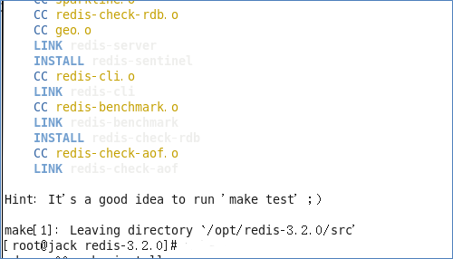
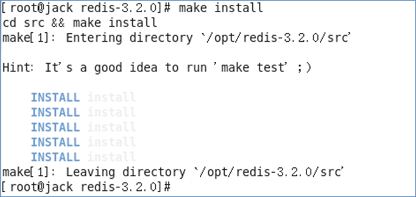
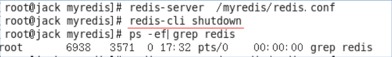

Redis 安装
====
##
### [返回Redis目录](./RedisDirectory.md)

### 安装步骤
1、下载获得Redis-3.2.5.tar.gz后将它放入我们的Linux目录/opt  
2、解压命令:tar -zxvf Redis-3.2.5.tar.gz  
3、解压完成后进入目录:cd redis-3.2.5  
4、在redis-3.2.5目录下执行make命令

    运行make命令时出现故障意出现的错误解析：gcc：命令未找到
     能上网：yum install gcc-c++
     不能上网：
       执行cd /media/CentOS_6.8_Final/Packages （路径跟centos5不同）进入安装包目录
                   依次执行以下：
                        rpm -ivh mpfr-2.4.1-6.el6.x86_64.rpm
                        rpm -ivh cpp-4.4.7-17.el6.x86_64.rpm
                        rpm -ivh ppl-0.10.2-11.el6.x86_64.rpm
                        rpm -ivh cloog-ppl-0.15.7-1.2.el6.x86_64.rpm
                        rpm -ivh gcc-4.4.7-17.el6.x86_64.rpm
                        
5、在redis-3.2.5目录下再次执行make命令

     Jemalloc/jemalloc.h：没有那个文件
     解决方案：运行make distclean之后再 make

6、在redis-3.2.5目录下再次执行make命令
  

7、执行完make后，跳过Redis test 继续执行make install
   

查看默认安装目录：usr/local/bin

     Redis-benchmark:性能测试工具，可以在自己本子运行，看看自己本子性
       能如何(服务启动起来后执行) 
     Redis-check-aof：修复有问题的AOF文件，rdb和aof后面讲
     Redis-check-dump：修复有问题的dump.rdb文件
     Redis-sentinel：Redis集群使用
     redis-server：Redis服务器启动命令
     Redis-cli：客户端，操作入口

### 启动

1 、备份redis.conf ：拷贝一份redis.conf 到其他目录

2 、修改redis.conf 文件将里面的daemonize no  改成 yes ，让服务kk在后台启动

3 、启动命令：执行 redis-server /myredis/redis.conf

4 、用客户端访问: Redis-cli

       
 
   多个端口可以 Redis-cli –p 6379

5 、测试验证： ping
  

      
### Redis关闭

单实例关闭：Redis-cli shutdown    

也可以进入终端后再关闭
   

多实例关闭，指定端口关闭 :Redis-cli -p 6379 shutdown

Redis相关知识

    端口6379从何而来Alessia Merz
    默认16 个数据库，类似数组下标从0 开始，初始默认使用0号库
    使用命令select  <dbid> 来切换数据库。如：select 3

    统一密码管理，所有库都是同样密码，要么都OK 要么一个也连接不上。

Redis 是单线程+多路 IO 复用技术

   多路复用是指使用一个线程来检查多个文件描述符（Socket）的就绪
状态，比如调用select和poll函数，传入多个文件描述符，如果有一个文
件描述符就绪，则返回，否则阻塞直到超时。得到就绪状态后进行真正
的操作可以在同一个线程里执行，也可以启动线程执行（比如使用线程
池）。

串行  vs  多线程+ + 锁（ memcached） ）  vs  单线程+ + 多路 IO 复用 (Redis)

[返回顶部](#readme)
