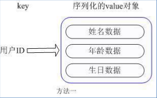
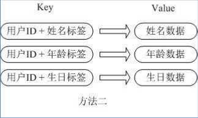
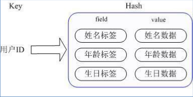

Redis Commend
====
##
### [返回Redis目录](./RedisDirectory.md) [回到首页目录](/README.md)

## 通用命令

    keys *

•  查询当前库的所有键

    exists <key>

•  判断某个键是否存在

    type <key>

•  查看键的类型

    del <key>

•  删除某个键

	expire <key> <seconds>

•  为键值设置过期时间，单位秒。

	ttl <key>

• 查看还有多少秒过期，-1 表示永不过期，-2 表示已过期

	dbsize

• 查看当前数据库的key 的数量

	flushdb

• 清空当前库

	flushall

• 通杀全部库

## String 

String 是 Redis 最基本的类型，你可以理解成与Memcached 一模一样的类型，一个 key 对应一个 value 。

String 类型是二进制安全的。意味着 Redis 的 string 可以包含任何数据。比如 jpg象 图片或者序列化的对象  。

String 类型是 Redis 最基本的数据类型，一个 Redis 中字符串 value 最多可以是

	get <key>

•  查询对应键值

	set <key> <value>

•  添加键值对

	append <key> <value>

•  将给定的<value>  追加到原值的末尾

	strlen <key>

•获得值的长度

	setnx <key> <value>

只有在 key  不存在时设置 key

	incr <key>

•  将 key  中储存的数字值增1
•  只能对数字值操作，如果为空，新增值为1

	decr <key>

•  将 key  中储存的数字值减1
•  只能对数字值操作，如果为空，新增值为-1

	incrby / decrby <key> < 步长>

•  将 key中储存的数字值增减。自定义步长。

原子性

• 所谓原子操作是指不会被线程调度机制打断的操作；这种操作一旦开始，就一
直运行到结束，中间不会有任何 context switch （切换到另一个线程）。

（1） 在单线程中， 能够在单条指令中完成的操作都可以认为是" 原子操作"，因为中断只能发生于指令之间。

（2）在多线程中，不能被其它进程（线程）打断的操作就叫原子操作。

Redis 单命令的原子性主要得益于 Redis 的单线程

java 中的 i++ 是否是原子操作？

	mset <key1> <value1> <key2> <value2> .....

•  同时设置一个或多个 key-value对 对

	mget <key1> <key2> <key3> .....

•  同时获取一个或多个 value

	msetnx <key1> <value1> <key2> <value2> .....

• 个 同时设置一个或多个 key-value  对，当且仅当所有给定key  都不存在。

	getrange <key> < 起始位置> < 结束位置>

•  获得值的范围，类似java 中的substring

	setrange <key> < 起始位置> <value>

•  用 <value>  覆写<key>  所储存的字符串值，从<起始位置> 开始。

	setex <key> < 过期时间> <value>

•  设置键值的同时，设置过期时间，单位秒。

	set k1 v1
	expire k1 10
	pexpire k1 10000
	set k1 v1 EX 10/ PX 10000
	pexpireat
	  expireat

next

	getset <key> <value>

•  以新换旧，设置了新值同时获得就值。

## Redis List

单键多值 Redis list 是简单的字符串列表，按照插入顺序排序。你可以添加一个元
素导列表的头部（左边）或者尾部（右边）。 
它的底层实际是个双向链表，对两端的操作性能很高，通过索引下标的操
作中间的节点性能会较差

    lpush/rpush <key> <value1> <value2> <value3> ....
•  从左边/ 右边插入一个或多个值。

    lpop/rpop <key>
•  从左边/ 右边吐出一个值。
•  值在键在，值光键亡。

    rpoplpush <key1> <key2>
•  从<key1> 列表右边吐出一个值，插到<key2> 列表左边。

	lrange <key> <index>
• 按照索引下标获得元素( 从左到右)

	lindex <key> <index>
• 按照索引下标获得元素( 从左到右)

	llen <key>
• 获得列表长度

	linsert <key> before <value > <newvalue>
• 在 <value> 的后面插入> <newvalue>

	lrem <key> <n> <value>
• 从左边删除n n 个 value( 从左到右)

## Redis Set

Redis set对外提供的功能与list类似是一个列表的功能，特殊之处在于set是可以自动排重的，当你需要存储一个列表数据，又不希望出现重复数据时，set是一个很好的选择，并且set提供了判断某个成员是否在一个set集合内的重要接口，这个也是list所不能提供的。

Redis的Set是string类型的无序集合。它底层其实是一个value为null的hash表,所以添加，删除，查找的复杂度都是O(1)。

	sadd <key> <value1> <value2> .....
• 将一个或多个 member 元素加入到集合 key 当中，已经存在于集合的 member 元素将被忽略。

	smembers <key>
• 取出该集合的所有值。

	sismember <key> <value>
• 判断集合<key>是否为含有该<value>值，有返回1，没有返回0

	scard <key>
• 返回该集合的元素个数。

	srem <key> <value1> <value2> ....
• 删除集合中的某个元素。

	spop <key>
• 随机从该集合中吐出一个值。

	srandmember <key> <n>
• 随机从该集合中取出n个值。
• 不会从集合中删除

	sinter <key1> <key2>
• 返回两个集合的交集元素。

	sunion <key1> <key2>
• 返回两个集合的并集元素。

	sdiff <key1> <key2>
• 返回两个集合的差集元素。

## Redis Hash

Redis hash 是一个键值对集合。

Redis hash是一个string类型的field和value的映射表，hash特别适合用于存储对象。类似Java里面的Map<String,Object>

用户ID为查找的key，存储的value用户对象包含姓名，年龄，生日等信息，如果用普通的key/value结构来存储，主要有以下2种存储方式：

 
    
每次修改用户的某个属性需要，先反序 

用户ID 数据冗余列化改好后再序列化回去。开销较大

通过 key( 用户ID) + field( 属性标签)  就可以操作对应属性数据了，既不需要重复存储数据，也不会带来序列化和并发修改控制的问题

	hset <key> <field> <value>
• 给<key>集合中的 <field>键赋值<value>

	hget <key1> <field>
• 从<key1>集合<field> 取出 value

	hmset <key1> <field1> <value1> <field2> <value2>...
• 批量设置hash的值

	hexists key <field>
• 查看哈希表 key 中，给定域 field 是否存在。

	hkeys <key>
• 列出该hash集合的所有field

	hvals <key>
•列出该hash集合的所有value

	hincrby <key> <field> <increment>
• 为哈希表 key 中的域 field 的值加上增量 increment
	
	hsetnx <key> <field> <value>
• 将哈希表 key 中的域 field 的值设置为 value ，当且仅当域 field 不存在 .

## Sorted Set

Redis有序集合zset与普通集合set非常相似，是一个没有重复元素的字符串集合。不同之处是有序集合
的没有成员都关联了一个 评分（score） ） ，这个 评分（score ）被用来按照从最低分到最高分的方式排序集合中的成员。集合的成员是唯一的，但是评分可以是重
复了 。

因为元素是有序的, 所以你也可以很快的根据评分（score）或者次序（position）来获取一个范围的元
素。访问有序集合的中间元素也是非常快的,因此你能够使用有序集合作为一个没有重复成员的智能列表。

	zadd <key> <score1> <value1> <score2> <value2>...
• 将一个或多个 member 元素及其 score 值加入到有序集 key 当中。

	zrange <key> <start> <stop> [WITHSCORES]
• 返回有序集 key 中，下标在<start> <stop>之间的元素
• 带WITHSCORES，可以让分数一起和值返回到结果集。

	zrangebyscore key min max [withscores] [limit offset count]
• 返回有序集 key 中，所有 score 值介于 min 和 max 之间
(包括等于 min 或 max )的成员。有序集成员按 score 值递
增(从小到大)次序排列。

	zrevrangebyscore key max min [withscores] [limit offset count]
• 同上，改为从大到小排列。

	zincrby <key> <increment> <value>
• 为元素的score加上增量

	zrem <key> <value>
• 删除该集合下，指定值的元素

	zcount <key> <min> <max>
• 统计该集合，分数区间内的元素个数

	zrank <key> <value>
• 返回该值在集合中的排名，从0开始。

[返回顶部](#readme)
