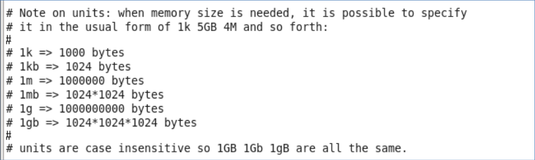
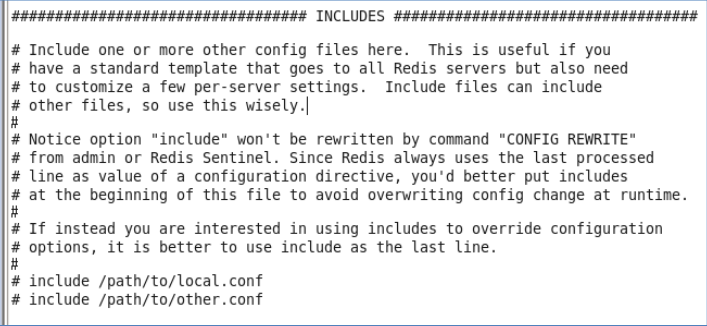

Redis Commend
====
##
### [返回Redis目录](./RedisDirectory.md)  [回到首页目录](/README.md)

计量单位说明

大小写不敏感

include

类似jsp中的include，多实例的情况可以把公用的配置文件提取出来

ip地址的绑定(bind)

      默认情况bind=127.0.0.1只能接受本机的访问请求
      不写的情况下，无限制接受任何ip地址的访问
      生产环境肯定要写你应用服务器的地址
      如果开启了protected-mode，那么在没有设定bind ip且
      没有设密码的情况下，Redis只允许接受本机的相应

tcp-backlog

      可以理解是一个请求到达后至到接受进程处理前的队列
      backlog队列总和=未完成三次握手队列 + 已经完成三次握手队列
      高并发环境tcp-backlog 设置值跟超时时限内的Redis吞吐量决定

timeout

     一个空闲的客户端维持多少秒会关闭，0为永不关闭。

TCP keepalive

     对访问客户端的一种心跳检测，每个n秒检测一次。官方推荐设为60秒。

daemonize

      是否为后台进程

pidfile

     存放pid文件的位置，每个实例会产生一个不同的pid文件

log level

     四个级别根据使用阶段来选择，生产环境选择notice 或者
warning

logfile

     日志文件名称

syslog

     是否将Redis日志输送到linux系统日志服务中

syslog-ident

     日志的标志

syslog-facility

     输出日志的设备

database

     设定库的数量 默认16

security

     在命令行中设置密码

maxclient

     最大客户端连接数

maxmemory

      设置Redis可以使用的内存量。一旦到达内存使用上限，
	Redis将会试图移除内部数据，移除规则可以通过maxmemory-policy来指定。
	如果Redis无法根据移除规则来移除内存中的数据，或者设置了“不允许移除”，
	那么Redis则会针对那些需要申请内存的指令返回错误信息，比如SET、LPUSH等。

Maxmemory-policy

      （1） volatile- - lru ：使用 LRU 算法移除 key ，只对设置了过期时间的键
      （2） allkeys- - lru ：使用 LRU 算法移除 key
      （3） volatile- - random ：在过期集合中移除随机的 key ，只对设置了过期时间的键
      （4） allkeys- - random ：移除随机的 key
      （5） volatile- - ttl ：移除那些 TTL 值最小的 key ，即那些最近要过期的 key
      （6） noeviction ：不进行移除。针对写操作，只是返回错误信息

Maxmemory-samples

     设置样本数量，LRU算法和最小TTL算法都并非是精确的算法，而是估算值，所以你可以设置样本的大小。
     一般设置3到7的数字，数值越小样本越不准确，但是性能消耗也越小。

[返回顶部](#readme)