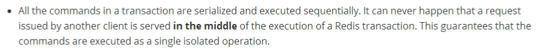
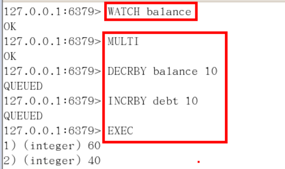

Redis Transaction
====
##
### [返回Redis目录](./RedisDirectory.md)  [回到首页目录](/README.md)
##

### Redis的事务定义

Redis事务是一个单独的隔离操作：事务中的所有命令都会序列化、按顺序地执行。事务在执行的过程中，不会被其他客户端发送来的命令请求所打断。

Redis事务的主要作用就是串联多个命令防止别的命令插队

	Multi 、Exec 、discard
从输入Multi命令开始，输入的命令都会依次进入命令队列中，但不会执行，至到输入Exec后，Redis会将之前的命令队列中的命令依次执行。组队的过程中可以通过discard来放弃组队。

事务的错误处理

    （1）组队中某个命令出现了报告错误，执行时整个的所有队列会都会被取消。
    （2）如果执行阶段某个命令报出了错误，则只有报错的命令不会被执行，而其他的命令都会执行，不会回滚。
    （3）两个请求
           一个请求想给金额加20
           一个请求想给金额加30

### 悲观锁，乐观锁

悲观锁(Pessimistic Lock), 顾名思义，就是很悲观，每次去拿数据的时候都认为别人会修改，所以每次在拿数据的时候都会上锁，这样别人想拿这个数据就会block直到它拿到锁。传统的关系型数据库里边就用到了很多这种锁机制，比如行锁，表锁等，读锁，写锁等，都是在做操作之前先上锁。

乐观锁(Optimistic Lock), 顾名思义，就是很乐观，每次去拿数据的时候都认为别人不会修改，所以不会上锁，但是在更新的时候会判断一下在此期间别人有没有去更新这个数据，可以使用版本号等机制。 乐观锁适用于多读的应用类型，这样可以提高吞吐量。Redis就是利用这种check-and-set机制实现事
务的。

    WATCH key [key ...]

在执行multi之前，先执行watch key1 [key2],可以监视一个(或多个)key ，如果在事务执行之前这个(或这些) key 被其他命令所改动，那么事务将被打断。

    unwatch
 取消 WATCH 命令对所有 key 的监视。如果在执行 WATCH 命令之后， EXEC 命令或 DISCARD 命令先被执行了的话，那么就不需要再执行 UNWATCH 了。

### 三特性

     单独的隔离操作
             事务中的所有命令都会序列化、按顺序地执行。事务在执行的过程
             中，不会被其他客户端发送来的命令请求所打断。
     没有隔离级别的概念
             队列中的命令没有提交之前都不会实际的被执行，因为事务提交前
             任何指令都不会被实际执行，也就不存在“事务内的查询要看到事
             务里的更新，在事务外查询不能看到”这个让人万分头痛的问题
     不保证原子性
             Redis同一个事务中如果有一条命令执行失败，其后的命令仍然会被
             执行，没有回滚

### 链接池参数

MaxTotal ：控制一个pool可分配多少个jedis实例，通过pool.getResource()来获取；如
果赋值为-1，则表示不限制；如果pool已经分配了 MaxTotal 个jedis实例，则此时pool的
状态为exhausted。

maxIdle：控制一个pool最多有多少个状态为idle(空闲)的jedis实例；

MaxWaitMillis ：表示当borrow一个jedis实例时，最大的等待毫秒数，如果超过等待时
间，则直接抛JedisConnectionException；

testOnBorrow：获得一个jedis实例的时候是否检查连接可用性（ping()）；如果为true，则得到的jedis实例均是可用的；

### LUA脚本

Lua 是一个小巧的脚本语言，Lua脚本可以很容易的被C/C++ 代码调用，也可以反过来调用C/C++的函数，Lua并没有提供强大的库，一个完整的Lua解释器不过200k，所以Lua不适合作为开发独立应用程序的语言，而是作为嵌入式脚本语言。

很多应用程序、游戏使用LUA作为自己的嵌入式脚本语言，以此来实现可配置性、可扩展性。这其中包括魔兽争霸地图、魔兽世界、博德之门、愤怒的小鸟等众多游戏插件或外挂。

LUA 脚本在Redis中的优势将复杂的或者多步的redis操作，写为一个脚本，一次提交给redis执行，减少反复连接redis的次数。提升性能。
        
LUA脚本是类似redis事务，有一定的原子性，不会被其他命令插队，可以完成一些redis事务性的操作。
但是注意redis的lua脚本功能，只有在2.6以上的版本才可以使用。

redis 2.6版本以后，通过lua脚本解决争抢问题，实际上是redis 利用其单线程的特性，用任务队列的方式解决多任务并发问题。

[返回顶部](#readme)