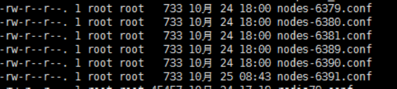
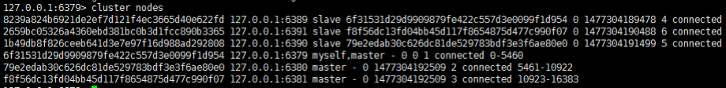

Redis Persistence
====
##
### [返回Redis目录](./RedisDirectory.md)  [回到首页目录](/README.md)
##

Redis的主从复制是什么

        主从复制，就是主机数据更新后根据配置和策略，自动同步到备机的master/slaver机制，Master 以写为主，Slave以读为主

用处

      读写分离，性能扩展
      容灾快速恢复

配从( 服务器) 不配主( 服务器)

      拷贝多个redis.conf 文件
      开启daemonize yes
      Pid 文件名字
      指定端口
      Log 文件名字
      Dump.rdb 名字
      Appendonly
<>

     info replication

打印主从复制的相关信息

    slaveof <ip> <port>
成为某个实例的从服务器

一主二仆模式演示

      1 切入点问题？slave1、slave2是从头开始复制还是从切入点开始复制?比如从k4进来，那之前的123是否也可以复制
      2 从机是否可以写？set可否？
      3 主机shutdown后情况如何？从机是上位还是原地待命
      4 主机又回来了后，主机新增记录，从机还能否顺利复制？
      5 其中一台从机down后情况如何？依照原有它能跟上大部队吗？

复制原理

      每次从机联通后，都会给主机发送sync指令
      主机立刻进行存盘操作，发送RDB文件，给从机
      从机收到RDB文件后，进行全盘加载
      之后每次主机的写操作，都会立刻发送给从机，从机执行相同的命令

薪火相传

     上一个slave可以是下一个slave的Master，slave同样可以接收其他slaves的连接和同步请求，那么该slave作为了链条中下一个的master, 可以有效减轻master的写压力,去中心化降低风险。
     用 slaveof <ip> <port>
     中途变更转向:会清除之前的数据，重新建立拷贝最新的
     风险是一旦某个slave宕机，后面的slave都没法备份 

反客为主

      当一个master宕机后，后面的slave可以立刻升为master，其后面的slave不用做任何修改。。
      用 slaveof no one 将从机变为主机。

哨兵模式(sentinal)

     反客为主的自动版，能够后台监控主机是否故障，如果故障了根据投票数自动将从库转换为主库.

配置哨兵

     调整为一主二仆模式
     自定义的/myredis目录下新建sentinel.conf文件
     在配置文件中填写内容：
      sentinel monitor mymaster 127.0.0.1 6379 1
     其中mymaster为监控对象起的服务器名称， 1 为 至少有多少个哨兵同意迁移的数量。

启动哨兵

      执行redis-sentinel /myredis/sentinel.conf

故障恢复

      新主登基
          从下线的主服务的所有从服务里面挑选一个从服务，
              将其转成主服务选择条件依次为：
                            1 、选择优先级靠前的
                            2 、选择偏移量最大的
                            3 、选择runid 最小的从服务
      群仆俯首
        挑选出新的主服务之后，sentinel 向原主服务的从服务
              发送slaveof 新主服务 的命令，复制新master
      旧主俯首
        当已下线的服务重新上线时，sentinel会向
              其发送slaveof命令，让其成为新主的从  

优先级在redis.conf中slave-priority 100偏移量是指获得原主数据最多的每个redis实例启动后都会随机生成一个40位的runid

### 什么是集群

       Redis 集群实现了对Redis的水平扩容，即启动N个redis节点，将整个数据库分布存储在这N个节点中，每个节点存储总数据的1/N。
       Redis 集群通过分区（partition）来提供一定程度的可用性（availability）： 即使集群中有一部分节点失效或者无法进行通讯， 集群也可以继续处理命令请求。


安装ruby环境

     1、 依次执行在安装光盘下的Package目录 (/media/CentOS_6.8_Final/Packages) 下
        的rpm包：
            • 执行rpm -ivh compat-readline5-5.2-17.1.el6.x86_64.rpm
            • 执行rpm -ivh ruby-libs-1.8.7.374-4.el6_6.x86_64.rpm
            • 执行rpm -ivh ruby-1.8.7.374-4.el6_6.x86_64.rpm
            • 执行rpm -ivh ruby-irb-1.8.7.374-4.el6_6.x86_64.rpm
            • 执行rpm -ivh ruby-rdoc-1.8.7.374-4.el6_6.x86_64.rpm
            • 执行rpm -ivh rubygems-1.3.7-5.el6.noarch.rpm
     2、拷贝redis-3.2.0.gem到/opt目录下
     3、执行在opt目录下执行 gem install --local redis-3.2.0.gem

制作6个实例，6379,6380,6381,6389,6390,6391

    •  拷贝多个redis.conf 文件
    •  开启daemonize yes
    • Pid 文件名字
    •  指定端口
    • Log 文件名字
    • Dump.rdb 名字
    • Appendonly

安装redis cluster配置修改

     • cluster-enabled yes 打开集群模式
     • cluster-config-file nodes-6379.conf 设定节点配置文件名
     • cluster-node-timeout 15000 设定节点失联时间，超过该时间（毫秒），
       集群自动进行主从切换。

将六个节点合成一个集群

       组合之前，请确保所有redis实例启动后，nodes-xxxx.conf文件都生成正常。



       合体：
       cd /opt/redis-3.2.5/src
        ./redis-trib.rb create --replicas 1
        192.168.31.211:6379 192.168.31.211:6380
        192.168.31.211:6381 192.168.31.211:6389
        192.168.31.211:6390 192.168.31.211:6391

通过 cluster nodes 命令查看集群信息



redis cluster 如何分配这六个节点?

       一个集群至少要有三个主节点。
       选项 --replicas 1 表示我们希望为集群中的每个主节点创建一个从节点。
       分配原则尽量保证每个主数据库运行在不同的IP地址，每个从库和主库不在一个IP地址上。

什么是slots

       一个 Redis 集群包含 16384 个插槽（hash slot）， 数据库中的每个键都属于这 16384 个插槽的其中一个， 集群使用公式 CRC16(key)% 16384 来计算键 key 属于哪个槽， 其中 CRC16(key) 语句用于计算键 key 的 CRC16 校验和 。
       集群中的每个节点负责处理一部分插槽。 举个例子， 如果一个集群可以有主节点， 其中：
      节点 A 负责处理 0 号至 5500 号插槽。
      节点 B 负责处理 5501 号至 11000 号插槽。
      节点 C 负责处理 11001 号至 16383 号插槽。

在集群中录入值

      在redis-cli每次录入、查询键值，redis都会计算出该key应该送往的插槽，如果不是该客户端对应服务器的插槽，redis会报错，并告知应前往的redis实例地址和端口。
      redis-cli客户端提供了 –c 参数实现自动重定向。
           如 redis-cli -c –p 6379 登入后，再录入、查询键值对可以自动重定向。
      不在一个slot下的键值，是不能使用mget,mset等多键操作。
      可以通过{}来定义组的概念，从而使key中{}内相同内容的键值对放到一个slot中去。

查询集群中的值

      CLUSTER KEYSLOT <key> 计算键 key 应该被放置在哪个槽上。
      CLUSTER COUNTKEYSINSLOT <slot> 返回槽 slot 目前包含的键值对数量。
      CLUSTER GETKEYSINSLOT <slot> <count> 返回 count 个 slot 槽中的键。

故障恢复

       如果主节点下限？从节点能否自动升为主节点？
       主节点恢复后，主从关系会如何？
       如果所有某一段插槽的主从节点都当掉，redis服务是否还能继续?
       redis.conf中的参数 cluster-require-full-coverage

集群的Jedis开发
```java
public class JedisClusterTest {
     public static void main(String[] args) {
            Set<HostAndPort> set =new HashSet<HostAndPort>();
            set.add(new HostAndPort("192.168.31.211",6379));
            JedisCluster jedisCluster=new JedisCluster(set);
             jedisCluster.set("k1", "v1");
            System.out.println(jedisCluster.get("k1"));
          }
     }
```

Redis 集群提供了以下好处：

      • 实现扩容
      • 分摊压力
      • 无中心配置相对简单

Redis 集群的不足：

      • 多键操作是不被支持的
      • 多键的Redis事务是不被支持的。lua脚本不被支持。
      • 由于集群方案出现较晚，很多公司已经采用了其他的集群方案，而代理或者客户端分片的方案想要迁移至redis cluster，需要整体迁移而不是逐步过渡，复杂度较大。


##
[返回顶部](#readme)