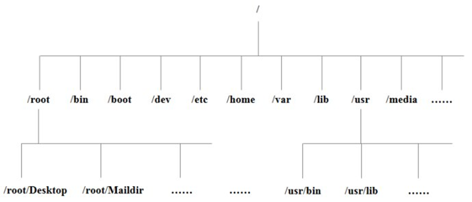

Linux
=======
by `groovyguang`
## 

## 一切皆文件

    01、 /bin★ (/usr/bin 、 /usr/local/bin)
        是Binary的缩写, 这个目录存放着最经常使用的命令
	02、/sbin (/usr/sbin、/usr/local/sbin)
	   s就是Super User的意思，这里存放的是系统管理员使用的系统管理程序
	03、/home ★
	    存放普通用户的主目录，在Linux中每个用户都有一个自己的目录，一般该目录名是以用户的账号命名的。
	04、/root ★
	    该目录为系统管理员，也称作超级权限者的用户主目录。
	05、/lib
	    系统开机所需要最基本的动态连接共享库，其作用类似于Windows里的DLL文件。几乎所有的应用程序都需要用到这些共享库。
	06、 /lost+found
	    这个目录一般情况下是空的，当系统非法关机后，这里就存放一些文件。
	07、/etc ★
	     所有的系统管理所需要的配置文件和子目录
	08、/usr ★
	    这是一个非常重要的目录，用户的很多应用程序和文件都放在这个目录下，类似于
	         Windows下的program files目录
	09、/boot ★
	    这里存放的是启动Linux时使用的一些核心文件，包括一些连接文件以及镜像文件,自己的安装别放在这里
	10、/proc
	    这个目录是一个虚拟的目录，它是系统内存的映射，我们可以通过直接访问这个目录来获取系统信息。
	11、/srv
	    service缩写，该目录存放一些服务启动之后需要提取的数据。
	12、/sys
	    这是Linux2.6内核的一个很大的变化。该目录下安装了2.6内核中新出现的一个文件系统sysfs
	13、/tmp
	    这个目录是用来存放一些临时文件的。
	14、/dev ★
	    类似于Windows的设备管理器，把所有的硬件用文件的形式存储。
	15、/media ★
	    Linux系统会自动识别一些设备，例如U盘，光驱等等，当识别后，Linux会把识别的设备挂载到这个目录下。
	16、/mnt
	    系统提供该目录是为了让用户临时挂载别的文件系统的，我们可以将外部的存储挂载在/mnt/上，然后进入该目录就可以查看里面的内容了。
	17、/opt ★
	    这是给主机额外安装软件所摆放的目录。比如你安装一个ORACLE数据库则就可以放到这个目录下。默认是空的
	18、/usr/local   ★
	    这是另一个给主机额外安装软件所摆放的目录。一般是通过编译源码方式安装的程序
	19、/var   ★
	    这个目录中存放着在不断扩充着的东西，我们习惯将那些经常被修改的目录放在这个目录下。包括各种日志文件
	20、/selinux
	    SELinux是一种安全子系统,它能控制程序只能访问特定文件

## vi/vim 编辑

### 编辑模式
   可以编写文字 
   
 要按下i,a,o,R等字母后才能进入编辑模式 
   
 进入后左下角会有[insert]或[replace]的字样 
   
 按下[ESC]这个按键即可以退出编辑模式
	   
| a | c |
| ------ | ------ |
| i,I | 当前光标前 |
| a,A | 当前光标后 |
| o,O | 当前光标行的下一行 |
| s,S | s:删除当前字符并进入编辑
S:删除整行并进入编辑 |
| R | 进入替换模式 |
	
| 表头1  | 表头2|
| ---------- | -----------|
| 表格单元   | 表格单元   |
| 表格单元   | 表格单元   |
