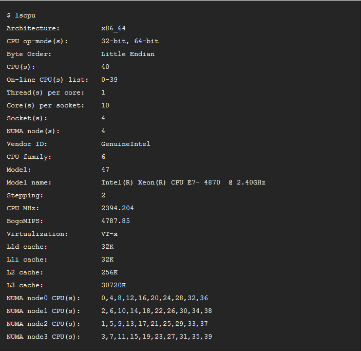
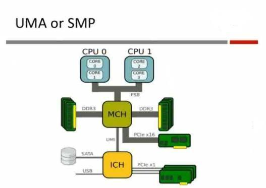
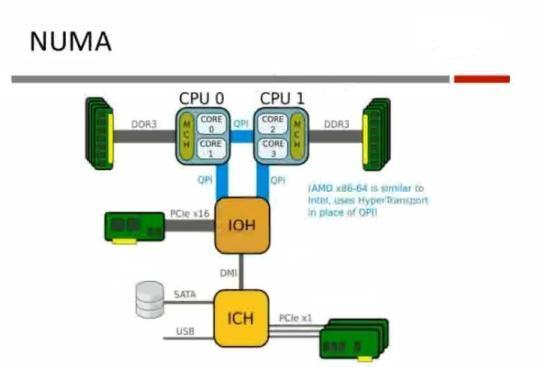
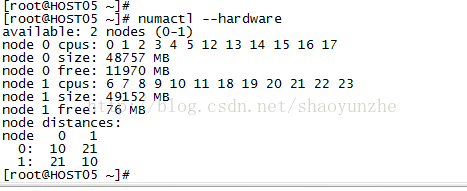
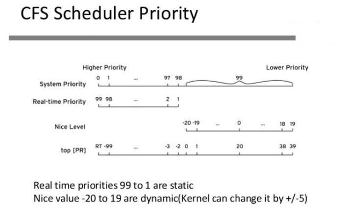

### 取得CPU硬件信息

基本常识： 所有的存储类的设备

离CPU越近会越快，离CPU越远将越慢

离CPU越近存储的容量越小，离CPU越远存储的容量越大

离CPU越近的是CPU自己，CPU的寄存器。寄存器的时钟周期和CPU是一样的，CPU有多少HZ，寄存器的反应就有多快

离CPU稍远的：
 
L1，在CPU中，使用静态内存做的，工艺也非常复杂，比寄存器要慢

L2，使用的是动态高速内存

L3

	Memory
	Storage     TB, PB
	lscpu

	[root@localhost ~]# lscpu -p
	# The following is the parsable format, which can be fed to other
	# programs. Each different item in every column has an unique ID
	# starting from zero.
	# CPU,Core,Socket,Node,,L1d,L1i,L2,L3
	0,0,0,0,,0,0,0,0
	1,1,0,0,,0,0,0,0
	2,2,1,0,,1,1,1,1
	3,3,1,0,,1,1,1,1

如:

CPU的相关指标：

	# cat /proc/cpuinfo			物理的，核心的，超线程的？
	# lscpu								RHEL6支持
	L1d cache							一级数据缓存
	L1i  cache							一级指令缓存
	L2										二级缓存（L2是否共享?）
	Thread(s) per core:			线程数为1，不支持超线程
	Core(s) per socket:			CPU核数

#### SMP(UMA)和NUMA架构

	SMP(Symmetric Multi-Processor)
      MCH:  	内存控制芯片，即北桥
      ICH： 	I/O控制芯片，即南桥，连接外设，硬盘，USB，慢速PCI总线设备

所谓对称多处理器结构，是指服务器中多个CPU对称工作，无主次或从属关系。
各CPU共享相同的物理内存，每个 CPU访问内存中的任何地址所需时间是相同的，因此SMP也被称为一致存储器访问结构(UMA：Uniform Memory Access)。
对SMP服务器进行扩展的方式包括增加内存、使用更快的CPU、增加CPU、扩充I/O(槽口数与总线数)以及添加更多的外部设备

缺点

SMP服务器的主要特征是共享，系统中所有资源(CPU、内存、I/O等)都是共享的。也正是由于这种特征，导致了SMP服务器的主要问题，那就是它的扩展能力非常有限。对于SMP服务器而言，每一个共享的环节都可能造成SMP服务器扩展时的瓶颈，而最受限制的则是内存。由于每个CPU必须通过相同的内存总线访问相同的内存资源，因此随着CPU数量的增加，内存访问冲突将迅速增加，最终会造成CPU资源的浪费，使 CPU性能的有效性大大降低。实验证明，SMP服务器CPU利用率最好的情况是2至4个CPU。   

#### NUMA(Non-Uniform Memory Access)

       IOH： 	I/O HUB，也可以叫北桥
	   NUMA	架构显著的特色是：内存划分成片，CPU访问本区的内存的时候，速度非常快

由于SMP在扩展能力上的限制，人们开始探究如何进行有效地扩展从而构建大型系统的技术，NUMA就是这种努力下的结果之一。利用NUMA技术，可以把几十个CPU(甚至上百个CPU)组合在一个服务器内。

NUMA服务器的基本特征是具有多个CPU模块，每个CPU模块由多个CPU组成，并且具有独立的本地内存、I/O槽口等。由于其节点之间可以通过互联模块(如称为Crossbar Switch)进行连接和信息交互，因此每个CPU可以访问整个系统的内存(这是NUMA系统与MPP系统的重要差别)。显然，访问本地内存的速度将远远高于访问远地内存(系统内其它节点的内存)的速度，这也是非一致存储访问NUMA的由来。由于这个特点，为了更好地发挥系统性能，开发应用程序时需要尽量减少不同CPU模块之间的信息交互。利用NUMA技术，可以较好地解决原来SMP系统的扩展问题，在一个物理服务器内可以支持上百个CPU

缺点

NUMA技术同样有一定缺陷，由于访问远地内存的延时远远超过本地内存，因此当CPU数量增加时，系统性能无法线性增加。如HP公司发布Superdome服务器时，曾公布了它与HP其它UNIX服务器的相对性能值，结果发现，64路CPU的Superdome (NUMA结构)的相对性能值是20，而8路N4000(共享的SMP结构)的相对性能值是6.3。从这个结果可以看到，8倍数量的CPU换来的只是3倍性能的提升。

numa的陷阱的问题。现象是当你的服务器还有内存的时候，发现它已经在开始使用swap了，甚至已经导致机器出现停滞的现象。这个就有可能是由于numa的限制，如果一个进程限制它只能使用自己的numa节点的内存，那么当自身numa node内存使用光之后，就不会去使用其他numa node的内存了，会开始使用swap，甚至更糟的情况，机器没有设置swap的时候，可能会直接死机！所以你可以使用numactl --interleave=all来取消numa node的限制。

### NUMA相关的策略

	1、每个进程（或线程）都会从父进程继承NUMA策略，并分配有一个优先node。如果NUMA策略允许的话，进程可以调用其他node上的资源。

	2、NUMA的CPU分配策略有cpunodebind、physcpubind。cpunodebind规定进程运行在某几个node之上，而physcpubind可以更加精细地规定运行在哪些核上。

	3、NUMA的内存分配策略有localalloc、preferred、membind、interleave。

	localalloc规定进程从当前node上请求分配内存；而preferred比较宽松地指定了一个推荐的node来获取内存，如果被推荐的node上没有足够内存，进程可以尝试别的node。

	membind可以指定若干个node，进程只能从这些指定的node上请求分配内存。

	interleave规定进程从指定的若干个node上以RR（Round Robin 轮询调度）算法交织地请求分配内存。

1.centos 安装支持numa命令

	yum install numactl

2.验证系统是否支持numa

	dmesg | grep -i numa查看输出结果：

如果输出结果为：

	No NUMA configuration found

说明numa为disable，如果不是上面的内容说明numa为enable

	[root@localhost ~]# dmesg | grep -i numa
	[    0.000000] NUMA: Node 0 [mem 0x00000000-0x0009ffff] + [mem 0x00100000-0x0fffffff] -> [mem 0x00000000-0x0fffffff]
	[    0.000000] NUMA: Node 0 [mem 0x00000000-0x0fffffff] + [mem 0x10000000-0x7fffffff] -> [mem 0x00000000-0x7fffffff]

3.查看numa的状态 numastat

	[root@localhost ~]# numastat 
	                           node0
	numa_hit                  878502
	numa_miss                      0
	numa_foreign                   0
	interleave_hit             20212
	local_node                878502
	other_node                     0

numa_hit是打算在该节点上分配内存，最后从这个节点分配的次数;

num_miss是打算在该节点分配内存，最后却从其他节点分配的次数;

num_foregin是打算在其他节点分配内存，最后却从这个节点分配的次数;

interleave_hit是采用interleave策略最后从该节点分配的次数;

local_node该节点上的进程在该节点上分配的次数

other_node是其他节点进程在该节点上分配的次数

4、查看numa相关信息，包括每个node内存大小，每个node中的逻辑cpu

	numactl --hardware

	--cpunodebind=node 绑定cpu绑定到node
	--physcpubind=cpus 将进程和cpu绑定
	--membind=

3.lstpo工具

	yum install hwloc

	[root@localhost ~]# lstopo-no-graphics 
	Machine (1986MB)
	  Package L#0 + L3 L#0 (6144KB) + L2 L#0 (256KB) + L1d L#0 (32KB) + L1i L#0 (32KB)
	    Core L#0 + PU L#0 (P#0)
	    Core L#1 + PU L#1 (P#1)
	  Package L#1 + L3 L#1 (6144KB) + L2 L#1 (256KB) + L1d L#1 (32KB) + L1i L#1 (32KB)
	    Core L#2 + PU L#2 (P#2)
	    Core L#3 + PU L#3 (P#3)
	  HostBridge L#0
	    PCI 8086:7111
	    PCI 15ad:0405
	      GPU L#0 "card0"
	      GPU L#1 "renderD128"
	      GPU L#2 "controlD64"
	    PCI 1000:0030
	      Block(Disk) L#3 "sda"
	    PCIBridge
	      PCI 8086:100f
	        Net L#4 "eno16777736"
	      PCI 15ad:07e0
	        Block(Removable Media Device) L#5 "sr0"

### 进程

进程是什么?

  程序是一个文件,而process是一个执行中的程序实例。

   linux系统中创建新进程使用fork()系统调用。

利用分时技术，在linux操作系统上同时可以运行多个进程，当进程的时间片用完时，kernel就利用调度程序切换到另一个进程去运行。
  
内核中的调度程序用于选择系统中下一个要运行的进程。你可以将调度程序看做在所有出于运行状态的进程之间分配CPU运行时间的管理代码。为了让进程有效的使用系统资源，又能让进程有较快的相应时间，就需要对进程的切换调度采用一定的调度策略。

		[root@client test]# grep HZ /boot/config-3.10.0-327.el7.x86_64 
		CONFIG_NO_HZ_COMMON=y
		# CONFIG_HZ_PERIODIC is not set
		# CONFIG_NO_HZ_IDLE is not set
		CONFIG_NO_HZ_FULL=y
		# CONFIG_NO_HZ_FULL_ALL is not set
		CONFIG_NO_HZ=y
		# CONFIG_RCU_FAST_NO_HZ is not set
		# CONFIG_HZ_100 is not set
		# CONFIG_HZ_250 is not set
		# CONFIG_HZ_300 is not set
		CONFIG_HZ_1000=y   ---------------------------1秒1000次
		CONFIG_HZ=1000
		CONFIG_MACHZ_WDT=m
	
频率高   响应速度高  吞吐量低

频率低   响应速度底  吞吐量高

(根据应用需求选择)
  
每接收到一个时钟中断就要处理另一个任务.调度器----根据调度算法

timer 时钟中断

	可以用watch -n 1 cat /proc/interrupts来查看一下时钟中断

ps 命令的使用

状态说明

       D    不可中断睡眠 一般是由IO操作
	    watch -n 1 'ps ax | grep find ' 测试

       R    运行状态 在运行队列内
       S    sleep 睡眠状态 可中断  ps ax|grep firefox

       T    停止状态 正在进行任务控制信号
	.
       W    2.6内核无效
       X    已死看不到
       Z    存数据的内存空间已经释放回收了 pid的结构还在 消耗很小内存,不会碍事  重启杀不死

       For BSD formats and when the stat
       keyword is used, additional characters
       may be displayed:
       <    high-priority (not nice to other
            users)
       N    low-priority (nice to other users)
       L    内存页被锁住了 比如有一个程序运行需要消耗很多的内存,
			内存空间不足了就会将不活跃的进程占有的内存交换到虚拟内存中 
			需要时在交换回来称为换出换入, 如果有个进程想即使不活跃也不要将该进程内存交换出去,
			这是我们就可以锁这些内存页 有开发者来做 这样的操作更安全, 
			避免其他程序读取改程序交换出去之后 留在内存中的数据
       s    会话头 就是一个父进程
       l    表示以线程方式工作
       +    表示是一个进程组 而不是一个进程

ps  aux

	USER       PID %CPU %MEM    VSZ   RSS TTY      STAT START   
	TIME COMMAND
	root         1  0.0  0.0  19360  1532 ?        Ss   11:28   
	0:03 /sbin/init
	root         2  0.0  0.0      0     0 ?        S    11:28   
	0:00 [kthreadd]
	root         3  0.0  0.0      0     0 ?        S    11:28   
	0:00 [migration/0]
	root         4  0.0  0.0      0     0 ?        S    11:28   
	0:00 [ksoftirqd/0]

%CPU 消耗的cpu百分比 

%MEM 消耗内存百分比

VSZ  虚拟消耗内存大小  自身消耗和公共消耗

RSS  实际消耗内存  

ps auxw -p 3288  w宽幅显示  -p 只显示某一个	进程

ps命令格式3中

1.unix选项 有一个 -
2.BSD选项 没有-
3.GNU 有两个--

还可以

	ps -o user,pid,%cpu -p 3288
	ps -eo  user,pid,%cpu  --sort %cpu 升序 -%cpu 降序

top命令

	P 按cpu排序
	M 按内存排序
	f 添加删除字段 
	q 退出
	k 给进程发送信号

ps -l

	F S   UID   PID  PPID  C PRI  NI ADDR SZ WCHAN  TTY          
	TIME CMD
	4 S     0  2921  2910  0  80   0 - 27116 wait   pts/1    
	00:00:00 bash
	4 R     0  4261  2921  3  80   0 - 27032 -      pts/1    
	00:00:00 ps

nice (-20~19)

	nice
	renice

pri值范围是多少呢?

进程优先级(pri)：

	0-139  其中0号为优先级最高，139为最低
	0-99    实时进程优先级别范围 ， 0号保留，设置时使用1-99
	100-139  非实时进程的优先级别范围 (由nice值映射过来) 

调节调度策略

Linux 调度器执行大量的调度原则，以此决定线程运行的位置和时长。调度原则主要有两类：普通原则和实时原则。普通原则用于普通优先级任务，实时原则用于具有时效性且必须无中断完成的任务

实时线程不受时间间隔的控制，这意味着它们将一直运行直至它们阻拦、退出、主动让步或是被更高优先权的线程预先安置。最低优先权的实时线程会先于其他普通原则的线程进行调度。

SCHED_FIFO 静态优先级调度

SCHED_FIFO （也叫做静态优先级调度）是一项实时策略，定义了每个线程的固定优先级。这一策略让管理员能改进事件响应的时间并减少延迟，这一策略建议无法运行较长时间且具有时效性的任务使用。在使用 SCHED_FIFO 时，调度器会按优先级顺序扫描所有的 SCHED_FIFO 线程，并对准备运行的最高优先级线程进行调度。一个 SCHED_FIFO 线程的优先级级别可以是 1 至 99 之间的任何整数，99 是最高优先级。红帽建议一开始使用较小的数字，在确定了延迟问题后再增加优先级。

管理员可以限制 SCHED_FIFO 的带宽以防止实时应用程序的程序员启用独占处理器的实时任务。

	/proc/sys/kernel/sched_rt_period_us

该参数以微秒为单位来定义时间，是百分之百的处理器带宽。默认值为 1000000 μs, 或1秒。

	/proc/sys/kernel/sched_rt_runtime_us

该参数以微秒为单位来定义时间，用来运行实时线程。默认值为 950000 μs, 或0.95秒。

SCHED_RR 轮循优先级调度

SCHED_RR 是 SCHED_FIFO 的一个轮循变形。这一策略在同优先级的多线程需要运行时很有用。
正如 SCHED_FIFO，SCHED_RR 是一项实时策略，定义了每个线程的固定优先级。调度器会按优先级顺序扫描所有的 SCHED_RR 线程，并对准备运行的最高优先级线程进行调度。但是，和 SCHED_FIFO 不同，同优先级的线程在一定的时间间隔内是以循环的方式进行调度的。

用户可以使用 sched_rr_timeslice_ms 内核参数，并毫秒为单位设定这一时间间隔 (/proc/sys/kernel/sched_rr_timeslice_ms) 。最小值为1毫秒。

SCHED_OTHER 普通调度

SCHED_OTHER 是红帽企业版 Linux 7 中默认的调度策略。这一策略使用 CFS （完全公平排程器）让处理器能够平等地访问用此策略调度的所有线程。这一策略在有大量线程或数据吞吐量优先时最为有用，因为它能够随着时间而更为有效地调度线程。在使用这一策略时，调度器会创建一个动态优先级列表，此列表一部分是基于每个进程线程的进程优先级。管理员可以改变一个进程的进程优先级，但是不能直接改变调度器的动态优先级列表。

查看进程的调度策略
	
	[root@client tmp]# chrt -p 1
	pid 1 的当前调度策略：SCHED_OTHER
	pid 1 的当前调度优先级：0
	[root@client tmp]# chrt -p 2
	pid 2 的当前调度策略：SCHED_OTHER
	pid 2 的当前调度优先级：0
	[root@client tmp]# chrt -p 3
	pid 3 的当前调度策略：SCHED_OTHER
	pid 3 的当前调度优先级：0
	[root@client tmp]# chrt -p 7
	pid 7 的当前调度策略：SCHED_FIFO
	pid 7 的当前调度优先级：99
	
	设置进程调度策略 chrt 

CPU亲和力

在多核情况下，可以认为指定在哪颗CPU上执行程序

	taskset
	taskset -c 0 /a.sh
	taskset 值得是cpu亲和力

进程和线程 有本质的区别

	线程模式      创建和撤销开销小  资源竞争问题
	进程模式	 创建和撤销开销大  没有资源竞争问题

线程 多线程进程

进程 单线程进程

如apache 线程和进程模式 多核
	
	每秒处理并发访问量 达到1000 
	进程方式 单位时间呢创建撤销1000进程
	线程方式 范围时间内创建撤销 1000线程
	这是线程表现较好

启动apache线程模式

	ps -L -p pid  显示所有线程 lwp 轻量级线程pid
	
	ab -n 1000 -c 1000 http://localhost/index.html  测试
	
	当2000时 apache 挂了  ab命令最多支持2个万测试

测试nginx

	单进程和多进程
	加大页面内容
	
	cps 每秒的并发连接数(TCP)
	qps 每秒的并发请求数 GET/HEAD/DELETE/PUT

实现cpu的绑定有专门工具(非numa也可以用)

	taskset   
	 0x0000 00001
	0001： 0号cpu
	 0x0000 00003
	0011： 0号和1号cpu
	 0x0000 00005
	0101： 0 和 2
	 0x0000 00007
	0111： 0 1 和 2
	
	taskset -p mask pid
	taskset -p -c 3  pid

绑定程序的cpu会不会在运行其它的进程？当前会调度到该cpu
比如有16核心。我们让14核心只运行特定进程，其他两核运行其他的进程
启动时/boot/grub/grub.conf

isolcpus=cpu0，cpu1 .... 隔离cpu 启动时不使用这些cpu，在绑定
当时仍然不能保存该cpu只服务于绑定进程因为cpu还服务于中断

隔离中断 要么运行绑定进程要么运行内核(内核调度时)

	cat /proc/irp/0/smp_affinity
	ffffffff,ffffffff

表示该中断线可以运行在所有的cpu上

	echo cpu_mask > /proc/irp/<irq-number>/smp_affinity
	echo 00000001 > /proc/irp/0/smp_affinity

应该将中断绑定到那些非隔离cpu上，从而避免那些隔离的cpu处理中断
隔离2-15的中断

配置内核滴答记号时间

默认情况下，红帽企业版 Linux 7 使用无时钟内核，它不会中断空闲 CPU 来减少用电量，并允许较新的处理器利用深睡眠状态。

红帽企业版 Linux 7 同样提供一种动态的无时钟设置（默认禁用），这对于延迟敏感型的工作负载来说是很有帮助的，例如高性能计算或实时计算。

要启用特定内核中的动态无时钟性能，在内核命令行中用 nohz_full 参数进行设定。在 16 核的系统中，设定 nohz_full=1-15 可以在 1 到 15 内核中启用动态无时钟内核性能，并将所有的计时移动至唯一未设定的内核中（0 内核）。这种性能可以在启动时暂时启用，也可以在 /etc/default/grub 文件中永久启用。要持续此性能，请运行 grub2-mkconfig -o /boot/grub2/grub.cfg 指令来保存配置。

启用动态无时钟性能需要一些手动管理。

当系统启动时，必须手动将 rcu 线程移动至对延迟不敏感的内核，这种情况下为 0 内核。

	# for i in `pgrep rcu` ; do taskset -pc 0 $i ; done

检测工具

CPU使用率
TOP工具：   第三排信息值

	Cpu(s):     消耗CPU处理时间的百分比  （iostat 看更全的单词）
	95.8%us,		用户态     
	1.1%sy,  		内核态 
	2.6%ni,  		优先级切换
	0.0%id,  		CPU空闲				＊＊＊
	0.0%wa,  	等待，IO输入输出等待
	0.0%hi,  		硬中断          什么叫中断呢？  
                                   每个硬件都有会中断地址/proc/interrupts
	0.5%si,  		软中断
	0.0%st		CPU偷窃时间        ，与xen虚拟化有关系

如

	[root@xen ~]# iostat 
	Linux 2.6.18-194.el5xen (xen.pg.com)    2011年01月18日
	
	avg-cpu:  %user   %nice %system %iowait  %steal   %idle
	         	  2.75     0.75      1.31        1.89       0.01       93.29
	
	Device:            tps   Blk_read/s   Blk_wrtn/s   Blk_read   Blk_wrtn
	sda               7.46       152.21        82.99    1240948     676550
	sda1              1.05        11.99         0.03      97781        256
	sda2              0.00         0.00         0.00          6          0
	sda5              0.12         5.22         0.00      42549          0
	sda6              0.05         1.30         0.00      10621         16
	sda7              0.01         0.22         0.00       1818         38
	sda8              0.01         0.16         0.00       1315          0
	sda9              6.22       133.26        82.95    1086402     676240

观测占用CPU时间

top	(这个命令本身就挺消耗CPU时间的)
找出 R 状态的进程。

	临时:	使用renice 调整进程的优先级。
	治本：	要明确这个进程的功能了。
			如果有问题的，结束，修改程序。
			如果没有问题，是正常的进程。花钱买CPU。
			
举例：

	WEB服务器（PHP）
	CPU负载跟CPU使用率都很高，而且CPU不能扩充。
	怎么办？
		“集群“
	

进程列表:

ps	只对具体进程进行观测 
	
	ps -eo "pid,comm,rss,pcpu" --sort pcpu  升序
	ps -eo "pid,comm,rss,pcpu" --sort -pcpu  降序
	ps -eo "pid,comm,rss,pcpu,rtprio,ni,pri,stat" --sort -pcpu   实时进程优先级   如果显示为空，说明不是实时进程

man ps

	AIX FORMAT DESCRIPTORS
	This ps supports AIX format descriptors, which work somewhat like the formatting codes of
	printf(1) and printf(3). For example, the normal default output can be produced with this:
	ps -eo "%p %y %x %c". The NORMAL codes are described in the next section.
	
	CODE   NORMAL   HEADER
	%C     pcpu     %CPU
	%G     group    GROUP
	%P     ppid     PPID
	%U     user     USER
	%a     args     COMMAND
	%c     comm     COMMAND
	%g     rgroup   RGROUP
	%n     nice     NI
	%p     pid      PID
	%r     pgid     PGID
	%t     etime    ELAPSED
	%u     ruser    RUSER
	%x     time     TIME
	%y     tty      TTY
	%z     vsz      VSZ

多核心监测

mpstat
	-P ALL

	[root@xen ~]# mpstat 
	Linux 2.6.18-194.el5xen (xen.pg.com)    2011年01月18日
	
	12时16分20秒  CPU   %user   %nice    %sys %iowait    %irq   %soft  %steal   %idle    intr/s
	12时16分20秒  all    2.70    0.62    1.19    1.64    0.00    0.00    0.03   93.82    212.95
	[root@xen ~]# mpstat -P ALL
	Linux 2.6.18-194.el5xen (xen.pg.com)    2011年01月18日
	
	12时16分29秒  CPU   %user   %nice    %sys %iowait    %irq   %soft  %steal   %idle    intr/s
	12时16分29秒  all    2.70    0.62    1.19    1.64    0.00    0.00    0.03   93.82    213.14
	12时16分29秒    0    3.10    0.63    1.39    2.71    0.00    0.00    0.04   92.14    121.29
	12时16分29秒    1    2.31    0.61    0.98    0.58    0.00    0.00    0.02   95.50     91.85
	
	[root@xen ~]# mpstat -P 0 1 10 每隔一秒取一次，取10次

高级系统检查

	sar -u
使用率

	sar -q
系统平均负载
	
	[root@xen sa]# sar  -f /var/log/sa/sa18 
	Linux 2.6.18-194.el5xen (xen.pg.com)    2011年01月18日
	
	09时50分01秒       CPU     %user     %nice   %system   %iowait    %steal     %idle
	10时00分01秒       all      2.08      0.00      0.32      0.15      0.01     97.44
	10时10分01秒       all      1.74      0.00      0.36      0.21      0.01     97.68
	10时20分01秒       all      3.04      0.00      0.33      0.02      0.01     96.60
	10时30分01秒       all      6.22      0.00      1.16      0.15      0.01     92.45
	10时40分01秒       all      2.79      0.17      0.75      0.16      0.01     96.13
	10时50分01秒       all      5.55      9.29      9.93     15.51      0.03     59.68
	11时00分01秒       all      4.32      0.50      1.28      0.49      0.01     93.40
	11时10分01秒       all      0.03      0.00      0.02      0.00      0.01     99.94
	11时20分01秒       all      0.03      0.00      0.03      0.06      0.01     99.87
	11时30分01秒       all      0.04      0.00      0.01      0.03      0.01     99.91
	11时40分01秒       all      0.04      0.08      0.04      0.04      0.01     99.79
	11时50分01秒       all      3.06      0.00      0.67      0.03      0.01     96.23
	12时00分01秒       all      2.72      0.00      0.70      1.17      0.23     95.17
	12时10分01秒       all      0.64      0.00      0.28      0.04      0.05     98.99
	12时20分01秒       all      3.52      0.00      0.66      0.04      0.07     95.70
	12时30分01秒       all      4.52      0.00      1.05      0.04      0.08     94.31
	12时40分01秒       all      4.31      0.08      1.22      0.05      0.08     94.27
	Average:          all      2.63      0.60      1.11      1.07      0.04     94.56

=======

	[root@xen sa]# sar -u -f /var/log/sa/sa18 
	Linux 2.6.18-194.el5xen (xen.pg.com)    2011年01月18日
	
	09时50分01秒       CPU     %user     %nice   %system   %iowait    %steal     %idle
	10时00分01秒       all      2.08      0.00      0.32      0.15      0.01     97.44
	10时10分01秒       all      1.74      0.00      0.36      0.21      0.01     97.68
	10时20分01秒       all      3.04      0.00      0.33      0.02      0.01     96.60
	10时30分01秒       all      6.22      0.00      1.16      0.15      0.01     92.45
	10时40分01秒       all      2.79      0.17      0.75      0.16      0.01     96.13
	10时50分01秒       all      5.55      9.29      9.93     15.51      0.03     59.68
	11时00分01秒       all      4.32      0.50      1.28      0.49      0.01     93.40
	11时10分01秒       all      0.03      0.00      0.02      0.00      0.01     99.94
	11时20分01秒       all      0.03      0.00      0.03      0.06      0.01     99.87
	11时30分01秒       all      0.04      0.00      0.01      0.03      0.01     99.91
	11时40分01秒       all      0.04      0.08      0.04      0.04      0.01     99.79
	11时50分01秒       all      3.06      0.00      0.67      0.03      0.01     96.23
	12时00分01秒       all      2.72      0.00      0.70      1.17      0.23     95.17
	12时10分01秒       all      0.64      0.00      0.28      0.04      0.05     98.99
	12时20分01秒       all      3.52      0.00      0.66      0.04      0.07     95.70
	12时30分01秒       all      4.52      0.00      1.05      0.04      0.08     94.31
	12时40分01秒       all      4.31      0.08      1.22      0.05      0.08     94.27
	Average:          all      2.63      0.60      1.11      1.07      0.04     94.56

=====

	[root@xen sa]# sar -q -f /var/log/sa/sa18 
	Linux 2.6.18-194.el5xen (xen.pg.com)    2011年01月18日
	
	09时50分01秒   runq-sz  plist-sz   ldavg-1   ldavg-5  ldavg-15
	10时00分01秒         0       220      0.03      0.12      0.17
	10时10分01秒         0       220      0.25      0.10      0.10
	10时20分01秒         0       220      0.02      0.07      0.08
	10时30分01秒         0       220      0.16      0.19      0.12
	10时40分01秒         0       225      0.32      0.22      0.13
	10时50分01秒         4       227      1.65      1.28      0.69
	11时00分01秒         0       220      0.00      0.24      0.40
	11时10分01秒         0       220      0.00      0.02      0.19
	11时20分01秒         0       221      0.00      0.00      0.08
	11时30分01秒         0       221      0.00      0.00      0.02
	11时40分01秒         0       221      0.08      0.02      0.01
	11时50分01秒         2       221      0.42      0.22      0.08
	12时00分01秒         0       229      0.17      0.13      0.08
	12时10分01秒         0       232      0.00      0.01      0.03
	12时20分01秒         2       228      0.30      0.16      0.09
	12时30分01秒         1       228      0.33      0.18      0.11
	12时40分01秒         1       228      0.31      0.20      0.11
	Average:            1       224      0.24      0.19      0.15
		

立刻采集显示 <interval>  <count> 

	sar -q 1 100
	sar -u 1 10 即时性的报告

获取CPU各个核心信息

	sar -u -P ALL 1
	[root@xen sa]# sar -I ALL 1

获取每个进程CPU使用率，注意默认这个数据不记录在数据库。

	sar -x ALL 1 3  *

指定文件读取

	sar -u -f /var/log/sa/sa28

输出SAR格式数据

	sar -u 1 10 -o /tmp/ooo

根据时间过滤数据

	sar -u -s 13:00:00 -e 13:05:01
如

	[root@xen sa]# sar -u -f /var/log/sa/sa18  -s 09:50:01 -e 12:40:01
	Linux 2.6.18-194.el5xen (xen.pg.com)    2011年01月18日
	
	09时50分01秒       CPU     %user     %nice   %system   %iowait    %steal     %idle
	10时00分01秒       all      2.08      0.00      0.32      0.15      0.01     97.44
	10时10分01秒       all      1.74      0.00      0.36      0.21      0.01     97.68
	10时20分01秒       all      3.04      0.00      0.33      0.02      0.01     96.60
	10时30分01秒       all      6.22      0.00      1.16      0.15      0.01     92.45
	10时40分01秒       all      2.79      0.17      0.75      0.16      0.01     96.13
	10时50分01秒       all      5.55      9.29      9.93     15.51      0.03     59.68
	11时00分01秒       all      4.32      0.50      1.28      0.49      0.01     93.40
	11时10分01秒       all      0.03      0.00      0.02      0.00      0.01     99.94
	11时20分01秒       all      0.03      0.00      0.03      0.06      0.01     99.87
	11时30分01秒       all      0.04      0.00      0.01      0.03      0.01     99.91
	11时40分01秒       all      0.04      0.08      0.04      0.04      0.01     99.79
	11时50分01秒       all      3.06      0.00      0.67      0.03      0.01     96.23
	12时00分01秒       all      2.72      0.00      0.70      1.17      0.23     95.17
	12时10分01秒       all      0.64      0.00      0.28      0.04      0.05     98.99
	12时20分01秒       all      3.52      0.00      0.66      0.04      0.07     95.70
	12时30分01秒       all      4.52      0.00      1.05      0.04      0.08     94.31
	12时40分01秒       all      4.31      0.08      1.22      0.05      0.08     94.27
	Average:          all      2.63      0.60      1.11      1.07      0.04     94.56

	
附加
	
	[root@teacher html]# mpstat -P ALL  1 5
	[root@teacher html]# ps -eo "pid,%cpu,comm" --sort -%cpu | more 
	[root@teacher html]# watch -n 1 cat /proc/interrupts 
	[root@teacher html]# %user:%sys  3:1
	[root@teacher html]# %idle  30%
	[root@teacher html]# %iowait 值较高说明 io繁忙，检查磁盘IO消耗情况
	[root@teacher html]# intr/s 高, watch -n 1 cat /proc/interrupts 
	[root@teacher html]# rpm -q sysstat
	sysstat-7.0.2-11.el5
	[root@teacher html]#  sar  1 5
	Linux 2.6.18-308.el5 (teacher.uplooking.com)    2012年11月13日
	
	[root@teacher html]# sar -u -P ALL  1 5
	[root@teacher html]# 系统的平均负载：1 分钟的平均负载  >  N*3
	[root@teacher html]#  sar -q  1 10
	[root@teacher html]# uptime 
	 14:31:55 up  2:51,  8 users,  load average: 0.92, 0.98, 1.19
	[root@teacher html]#  sar -x ALL  1 1
	[root@teacher html]#  sar -x 3281 1 100
	Linux 2.6.18-308.el5 (teacher.uplooking.com)    2012年11月13日

安装 yum install dstat

	[root@teacher html]# dstat

