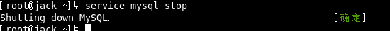

MySql Framing Introduce
====
##
### [返回Nginx目录](./NginxDirectory.md) [回到首页目录](/README.md)

## Introduce MySql

MySQL是一个关系型数据库管理系统，由瑞典MySQL AB公司开发，目前属于Oracle公司。

MySQL是一种关联数据库管理系统，将数据保存在不同的表中，而不是将所有数据放在一个大仓库内，这样就增加了速度并提高了灵活性。
 
Mysql是开源的，所以你不需要支付额外的费用。

Mysql是可以定制的，采用了GPL协议，你可以修改源码来开发自己的Mysql系统。

Mysql支持大型的数据库。可以处理拥有上千万条记录的大型数据库。

MySQL使用标准的SQL数据语言形式。

Mysql可以允许于多个系统上，并且支持多种语言。这些编程语言包括C、C++、Python、Java、Perl、PHP、Eiffel、Ruby和Tcl等。

MySQL支持大型数据库，支持5000万条记录的数据仓库，32位系统表文件最大可支持4GB，64位系统支持最大的表文件为8TB。

## Installing mysql5.5 

[官网下载地址](http://dev.mysql.com/downloads/mysql/)

### 检查工作：

   检查当前系统是否安装过mysql执行安装命令前，先执行查询命令

     rpm -qa|grep mysql

如果存在mysql-libs的旧版本包如下：

请先执行卸载命令：
    rpm -e --nodeps  mysql-libs

检查/tmp文件夹权限

	由于mysql安装过程中，会通过mysql用户在/tmp目录下新建tmp_db文件，所以请给/tmp较大的权限执行 ：
    chmod -R 777 /tmp

### 安装：

在mysql的安装文件目录下执行：

	rpm -ivh MySQL-client-5.5.54-1.linux2.6.x86_64.rpm
	rpm -ivh MySQL-server-5.5.54-1.linux2.6.x86_64.rpm

查看Mysql安装版本

或者可以执行`mysqladmin --version`命令，类似`java -version`如果打出消息，即为成功。

通过vim 查看 mysql用户和mysql组

### mysql服务的启+停

启动：

关闭：

### 首次登录

 安装完成后会提示出如下的提示：

在mysql首次登录前要给 `root` 账号设置密码

启动服务后，执行命令

	/usr/bin/mysqladmin -u root  password '123123'

然后通过 `mysql -uroot -p123123`进行登录

	
	
## mysql的安装位置，在Linux下查看安装目录 

|参数|路径|解释|备注|
| :--: | :--: | :--: | :--: |
| --basedir | /usr/bin | 相关命令目录 | mysqladmin mysqldump等命令 |
[返回顶部](#readme)	
