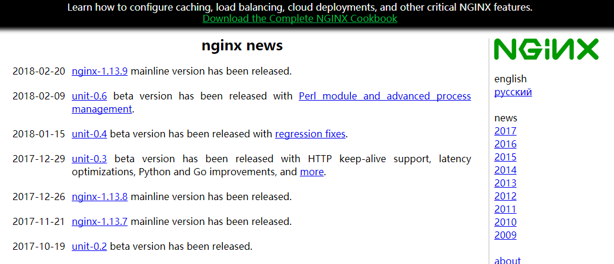
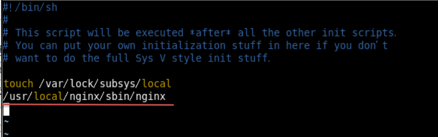

Nginx Install
====
##
### [返回Nginx目录](./NginxDirectory.md) [回到首页目录](/README.md)


### 1.安装nginx

Nginx 官网 http://nginx.org



需要的素材

	pcre-8.37.tar.gz
	openssl-1.0.1t.tar.gz
	zlib-1.2.8.tar.gz
	nginx-1.11.1.tar.gz

1.1.安装pcre

解压缩pcre-xx.tar.gz包
进入解压缩目录，执行./configure
如果提示，需要提前安装gcc++
进入安装光盘目录的软件包(/media/CentOSXX/Package)
执行

	rpm -ivh libstdc++-devel-4.4.7-17.el6.x86_64.rpm
	rpm -ivh gcc-c++-4.4.7-17.el6.x86_64.rpm
	./configure完成后，回到pcre目录下执行make，再执行make install

1.2. 安装openssl
	tar -zxvf pcre-8.37.tar.gz
	cd pcre-8.34
	./configure
	make
	make install

	1、 解压缩openssl-xx.tar.gz包。
	2、 进入解压缩目录，执行./config
	3、 make & make install

1.3. 安装zlib

	1、 解压缩zlib-xx.tar.gz包。
	2、 进入解压缩目录，执行./configure。
	3、 make & make install

1.4. 安装nginx

	1、 解压缩nginx-xx.tar.gz包。
	2、 进入解压缩目录，执行./configure。
	3、 make & make install

nginx无法启动: libpcre.so.1/libpcre.so.0: cannot
open shared object file解决办法
解决方法：

	ln -s /usr/local/lib/libpcre.so.1 /lib64
	32位系统则：
	ln -s /usr/local/lib/libpcre.so.1 /lib

启动命令

    在/usr/local/nginx/sbin目录下执行 ./nginx

关闭命令

    在/usr/local/nginx/sbin目录下执行 ./nginx -s stop

重新加载命令

    在/usr/local/nginx/sbin目录下执行 ./nginx -s reload

设置nginx为自启动服务

	修改linux 启动脚本/etc/rc.d/rc
	加入 :
	/usr/local/nginx/sbin/nginx




进入首页


### 2.结合redis配置负载均衡

1、首先准备两个同时启动的Tomcat
2、拷贝对应jar包到tomcat下lib包中

       commons-pool2-2.0.jar
       tomcat-redis-session-manager1.2.jar
       jedis-2.5.2

3、修改tomcat的下content.xml(加到最下方)
```html
<Valve
className="com.orangefunction.tomcat.redissessions.RedisSessionHandlerValv
e" />

<Manager
className="com.orangefunction.tomcat.redissessions.RedisSessionManager"
host="127.0.0.1"
port="6379"
database="0"
maxInactiveInterval="60" />
```

4、启动redis

5、配置nginx.conf

	http {
		......
		upstream myserver{
			ip_hash;
			server 115.28.52.63:8080 weight=1;
			server 115.28.52.63:8180 weight=1;
			}
		.....
		server{
			location / {
				.........
				proxy_pass http://myserver;
				proxy_connect_timeout 10;
				proxy_redirect default;
				}
				.........
	    }
	}


[返回顶部](#readme)