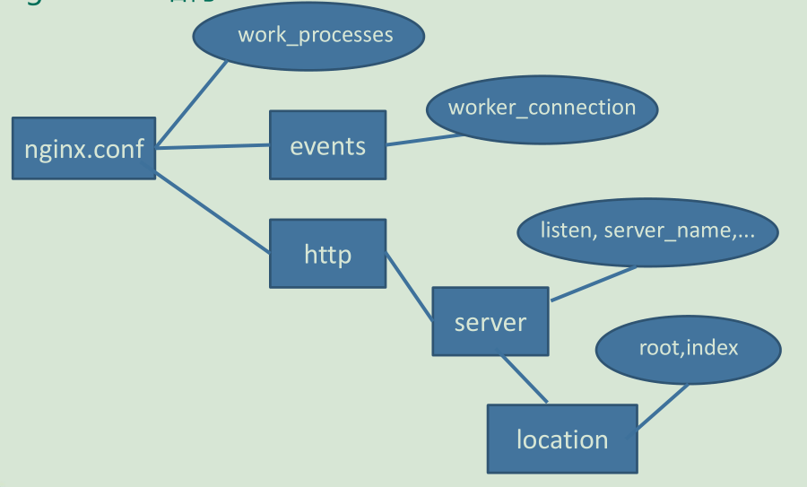

Nginx Install
====
##
### [返回Nginx目录](./NginxDirectory.md) [回到首页目录](/README.md)

### 1.master&worker

master-workers的机制的好处

      首先，对于每个worker进程来说，独立的进程，不需要加锁，所以省掉了锁带来的开销，同时在编程以及问题查找时，也会方便很多。
       其次，采用独立的进程，可以让互相之间不会影响，一个进程退出后，其它进程还在工作，服务不会中断，master进程则很快启动新的worker进程。当然，worker进程的异常退出，肯定是程序有bug了，异常退出，会导致当前worker上的所有请求失败，不过不会影响到所有请求，所以降低了风险。

需要设置多少个worker

  Nginx 同redis类似都采用了io多路复用机制，每个worker都是一个独立的进程，但每个进程里只有一个主线程，通过异步非阻塞的方式来处理请求， 即使是千上万个请求也不在话下。每个worker的线程可以把一个cpu的性能发挥到极致。
  
所以worker数和服务器的cpu数相等是最为适宜的。设少了会浪费cpu，设多了会造成cpu频繁切换上下文带来的损耗。

配置
		
        #设置worker数量。
		worker_processes 4
		#work绑定cpu(4 work绑定4cpu)。
		worker_cpu_affinity 0001 0010 0100 1000
	    # work绑定cpu (4 work绑定8cpu中的4个) 。
		worker_cpu_affinity 0000001 00000010 00000100
		00001000

连接数worker_connection

   这个值是表示每个worker进程所能建立连接的最大值，所以，一个nginx能建立的最大连接数，应该是worker_connections * worker_processes。当然，这里说的是最大连接数，对于HTTP请求本地资源来说，能够支持的最大并发数量是worker_connections * worker_processes，如果是支持http1.1的浏览器每次访问要占两个连接，所以普通的静态访问最大并发数是： worker_connections * worker_processes /2，而如果是HTTP作为反向代理来说，最大并发数量应该是worker_connections *worker_processes/4。因为作为反向代理服务器，每个并发会建立与客户端的连接和与后端服务的连接，会占用两个连接。

nginx.conf 结构

	#安全问题，建议用nobody,不要用root.
	#user  nobody;
	#worker数和服务器的cpu数相等是最为适宜
	worker_processes  2;
	#work绑定cpu(4 work绑定4cpu)
	worker_cpu_affinity 0001 0010 0100 1000
	#work绑定cpu (4 work绑定8cpu中的4个) 。
	worker_cpu_affinity 0000001 00000010 00000100 00001000  
	#error_log path(存放路径) level(日志等级)path表示日志路径，level表示日志等级，
	#具体如下：[ debug | info | notice | warn | error | crit ]
	#从左至右，日志详细程度逐级递减，即debug最详细，crit最少，默认为crit。
	#error_log  logs/error.log;
	#error_log  logs/error.log  notice;
	#error_log  logs/error.log  info;
	#pid        logs/nginx.pid;

	events {
	    #这个值是表示每个worker进程所能建立连接的最大值，所以，一个nginx能建立的最大连接数，应该是worker_connections * worker_processes。
	    #当然，这里说的是最大连接数，对于HTTP请求本地资源来说，能够支持的最大并发数量是worker_connections * worker_processes，
	    #如果是支持http1.1的浏览器每次访问要占两个连接，
	    #所以普通的静态访问最大并发数是： worker_connections * worker_processes /2，
	    #而如果是HTTP作为反向代理来说，最大并发数量应该是worker_connections * worker_processes/4。
	    #因为作为反向代理服务器，每个并发会建立与客户端的连接和与后端服务的连接，会占用两个连接。
	    worker_connections  1024;  
	    #这个值是表示nginx要支持哪种多路io复用。
	    #一般的Linux选择epoll, 如果是(*BSD)系列的Linux使用kquene。
	    #windows版本的nginx不支持多路IO复用，这个值不用配。
	    use epoll;
	    # 当一个worker抢占到一个链接时，是否尽可能的让其获得更多的连接,默认是off 。
	    multi_accept on;
	    # 默认是on ,开启nginx的抢占锁机制。
	    accept_mutex  on;
	}
    http {
    #当web服务器收到静态的资源文件请求时，依据请求文件的后缀名在服务器的MIME配置文件中找到对应的MIME Type，再根据MIME Type设置HTTP Response的Content-Type，然后浏览器根据Content-Type的值处理文件。
    include       mime.types;
    #如果 不能从mime.types找到映射的话，用以下作为默认值
    default_type  application/octet-stream;
    
     #日志位置
     access_log  logs/host.access.log  main;
     #一条典型的accesslog：
     #101.226.166.254 - - [21/Oct/2013:20:34:28 +0800] "GET /movie_cat.php?year=2013 HTTP/1.1" 200 5209 "http://www.baidu.com"; "Mozilla/4.0 (compatible; MSIE 8.0; Windows NT 6.1; Trident/4.0; SLCC2; .NET CLR 2.0.50727; .NET CLR 3.5.30729; .NET CLR 3.0.30729; Media Center PC 6.0; MDDR; .NET4.0C; .NET4.0E; .NET CLR 1.1.4322; Tablet PC 2.0); 360Spider"
     #1）101.226.166.254:(用户IP)
     #2）[21/Oct/2013:20:34:28 +0800]：(访问时间)
     #3）GET：http请求方式，有GET和POST两种
     #4）/movie_cat.php?year=2013：当前访问的网页是动态网页，movie_cat.php即请求的后台接口，year=2013为具体接口的参数
     #5）200：服务状态，200表示正常，常见的还有，301永久重定向、4XX表示请求出错、5XX服务器内部错误
     #6）5209：传送字节数为5209，单位为byte
     #7）"http://www.baidu.com"：refer:即当前页面的上一个网页
     #8）"Mozilla/4.0 (compatible; MSIE 8.0; Windows NT 6.1; Trident/4.0; SLCC2; .NET CLR 2.0.50727; .NET CLR 3.5.30729; #.NET CLR 3.0.30729; Media Center PC 6.0; MDDR; .NET4.0C; .NET4.0E; .NET CLR 1.1.4322; Tablet PC 2.0); 360Spider"： agent字段：通常用来记录操作系统、浏览器版本、浏览器内核等信息
    log_format  main  '$remote_addr - $remote_user [$time_local] "$request" '
                       '$status $body_bytes_sent "$http_referer" '
                      '"$http_user_agent" "$http_x_forwarded_for"';
    
    #开启从磁盘直接到网络的文件传输，适用于有大文件上传下载的情况，提高IO效率。
    sendfile        on;
   
    #一个请求完成之后还要保持连接多久, 默认为0，表示完成请求后直接关闭连接。
    #keepalive_timeout  0;
    keepalive_timeout  65;
    
    #开启或者关闭gzip模块
    #gzip  on ;
    #设置允许压缩的页面最小字节数，页面字节数从header头中的Content-Length中进行获取。
    #gzip_min_lenth 1k;
    # gzip压缩比，1 压缩比最小处理速度最快，9 压缩比最大但处理最慢（传输快但比较消耗cpu）
    #gzip_comp_level 4;
    #匹配MIME类型进行压缩，（无论是否指定）"text/html"类型总是会被压缩的。
    #gzip_types types text/plain text/css application/json  application/x-javascript text/xml  
    #动静分离
    #服务器端静态资源缓存，最大缓存到内存中的文件，不活跃期限
    open_file_cache max=655350 inactive=20s;   
   
    #活跃期限内最少使用的次数，否则视为不活跃。
    open_file_cache_min_uses 2;
    #验证缓存是否活跃的时间间隔
    open_file_cache_valid 30s;
    
    upstream myserver{
    # 1、轮询（默认）
    # 每个请求按时间顺序逐一分配到不同的后端服务器，如果后端服务器down掉，能自动剔除。
    # 2、指定权重
    # 指定轮询几率，weight和访问比率成正比，用于后端服务器性能不均的情况。
    #3、IP绑定 ip_hash
    # 每个请求按访问ip的hash结果分配，这样每个访客固定访问一个后端服务器，可以解决session的问题。
    #4、备机方式 backup
    # 正常情况不访问设定为backup的备机，只有当所有非备机全都宕机的情况下，服务才会进备机。
    #5、fair（第三方）
    #按后端服务器的响应时间来分配请求，响应时间短的优先分配。   
    #6、url_hash（第三方）
    #按访问url的hash结果来分配请求，使每个url定向到同一个后端服务器，后端服务器为缓存时比较有效。
      # ip_hash;
             server 192.168.161.132:8080 weight=1;
             server 192.168.161.132:8081 weight=1;
      
      #fair
      #hash $request_uri
      #hash_method crc32
      
      }
    server {
        #监听端口号
        listen       80;
        #服务名
        server_name  192.168.161.130;
        #字符集
        #charset utf-8;
    #location [=|~|~*|^~] /uri/ { … }   
    # = 精确匹配
    # ~ 正则匹配，区分大小写
    # ~* 正则匹配，不区分大小写
    # ^~  关闭正则匹配
    
    #匹配原则：
    
    # 1、所有匹配分两个阶段，第一个叫普通匹配，第二个叫正则匹配。
    # 2、普通匹配，首先通过“=”来匹配完全精确的location
        #   2.1、 如果没有精确匹配到， 那么按照最大前缀匹配的原则，来匹配location
        #   2.2、 如果匹配到的location有^~,则以此location为匹配最终结果，如果没有那么会把匹配的结果暂存，继续进行正则匹配。
        # 3、正则匹配，依次从上到下匹配前缀是~或~*的location, 一旦匹配成功一次，则立刻以此location为准，不再向下继续进行正则匹配。
        # 4、如果正则匹配都不成功，则继续使用之前暂存的普通匹配成功的location.
        location / {   # 匹配任何查询，因为所有请求都已 / 开头。但是正则表达式规则和长的块规则将被优先和查询匹配。
       
        #定义服务器的默认网站根目录位置
            root   html;
            
        #默认访问首页索引文件的名称
        index  index.html index.htm;
        #反向代理路径
            proxy_pass http://myserver;
        #反向代理的超时时间
            proxy_connect_timeout 10;
            proxy_redirect default;       
         }
         location  /images/ {    
        root images ;
     }
     location ^~ /images/jpg/ {  # 匹配任何已 /images/jpg/ 开头的任何查询并且停止搜索。任何正则表达式将不会被测试。
        root images/jpg/ ;
     }
         location ~*.(gif|jpg|jpeg)$ {
          
          #所有静态文件直接读取硬盘
              root pic ;
          
          #expires定义用户浏览器缓存的时间为3天，如果静态页面不常更新，可以设置更长，这样可以节省带宽和缓解服务器的压力
              expires 3d; #缓存3天
         }
        #error_page  404              /404.html;
        # redirect server error pages to the static page /50x.html
        #
        error_page   500 502 503 504  /50x.html;
        location = /50x.html {
            root   html;
        }
     }
    }

[返回顶部](#readme)
