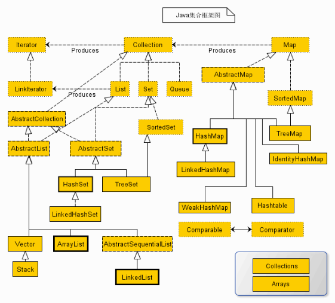

Collection
====
##
### [返回JavaSE目录](./JavaSEDirectory.md) [回到首页目录](/README.md)

	集合的概念
	集合的体系图 ★
	Collection接口的特点和常见方法
	List接口的特点和常见方法
	List接口的实现类
		ArrayList★
		LinkedList★
		Vector

	Set接口的特点和常见方法
	Set接口的实现类
		HashSet★
		TreeSet★
		LinkedHashSet

	Map接口的特点和常见方法
	Map接口的实现类
		HashMap ★
		TreeMap
		LinkedHashMap
		Properties √

	Collections工具类的学习
	泛型

## 集合的概念和好处 

### 集合的概念

	保存一组数的容器

数组：

	1.数组使用前必须指定长度
	2.数组的长度一旦固定将不能更改
	3.数组只能保存相同类型的元素
	Object[] obj = new Object[10];

	如果使用对象数组，实现数组的管理，比较麻烦

### 集合的好处

	1、集合不用指定长度
	2、集合可以自动扩容
	3、集合可以存储任意类型元素，而且管理比较方便

## 集合的体系图

## Collection的特点和常见方法

	 * add:添加单个元素，如果添加成功返回true
	 * addAll：批量添加某个集合的元素，如果添加成功返回true
	 * remove:移除指定元素，只移除一个，如果不存在，不移除
	 * removeAll:移除指定集合的元素
	 * clear:移除所有
	 * contains:判断是否包含某元素，如果包含返回true
	 * containsAll:判断是否包含某集合的所有元素，如果包含返回true
	 * isEmpty：判断集合中是否没有元素，如果么有，则返回true
	 * size：获取集合中元素的个数

## 遍历Collection的方式

方式一：

		//①获取迭代器
		Iterator iter = col.iterator();
		//②循环迭代
		while(iter.hasNext()){//判断下一个是否有元素
			Object next = iter.next();//取出下一个元素
			System.out.println(next);//处理该元素
			
		}

方式二：使用增强for

		for(Object obj: col){
			System.out.println(obj);
		}
	

## List接口

### 特点

1、有序（插入和取出的顺序是一致的），因为支持索引（索引从0开始）

2、允许重复的元素

### 常见方法

	add(int index,Object obj):在指定索引处插入元素
	remove(int index):删除指定索引处的元素
	set(int index,Object obj):修改指定索引处的元素
	get(int index):获取指定索引处的元素
	
	
	indexOf(元素)：查找该元素第一次出现的索引，如果找不到返回-1
	sublist（int start,int end）:获取某个范围内的元素

### 遍历方式

//方式一：使用Iterator

		Iterator iterator = list.iterator();
		while(iterator.hasNext()){
			System.out.println(iterator.next());
		}
		
		System.out.println("----------------------");
		
//方式二：使用增强for

		for (Object object : list) {
			System.out.println(object);
			
		}
		System.out.println("----------------------");

//方式三：使用普通for循环

		for(int i=0;i<list.size();i++){
			System.out.println(list.get(i));
		}

## List接口的实现类

### ArrayList

底层结构：可变数组
相当于里面维护了一个Object[] elementData

### LinkedList

底层结构：链表

里面维护了 两个重要的属性：first和last记录首节点和尾节点

每个节点又通过next记录下一个元素，通过prev记录上一个元素

### ArrayList和LinkedList的对比

				底层结构           增删改查的效率不同
	
	ArrayList	数组				  查找和修改的效率较高，增删效率较低
		
	LinkedList	链表				  查找和修改的效率较低，增删效率较高

共同点
				实现的接口		常见的方法		特点
	
	ArrayList	List			增删改查			允许重复，支持索引，有序
	
	LinkedList  同上				同上				同上

### Vector和ArrayList的区别

				底层结构		版本			线程安全		同步		效率
	
	ArrayList	数组			新（1.2）	不安全		不同步	高
	
	Vector		数组			旧（1.0）	安全			同步		低

## Set接口

### Set接口的特点

1、不允许重复
2、无序（插入和取出的顺序不一致），不支持索引

### HashSet的特点

底层结构：哈希表结构

	每次添加元素，需要先调用该元素的hashcode方法，判断集合中是否有和哈希值一样的，如果没有，则认为没有重复元素，直接添加。如果集合中有和当前哈希值一样的，则继续判断equals方法，如果有相同的，则添加不进去。如果没有相同的，则直接添加

注意：添加对象类型时，往往需要重写该对象类型的equals和hashCode方法，保证属性值一样的两个元素为重复元素！！！！

### TreeSet

一、特点

	底层结构：二叉树
	可以对添加的元素实现自然排序
	不允许添加重复的元素（通过比较，而不是通过hashCode和equals）

二、如何实现比较性

	方式一：自然排序
		步骤1：让添加对象的类型实现Comparable接口
		步骤2：实现Comparable接口中的方法 compareTo
	
	
	方式二：定制排序
		步骤1：创建TreeSet对象时，传入一个Comparator接口对象（比较器）
		步骤2：实现Comparator接口的方法compare方法

三、如何去重？
	
	通过比较方法的返回值是否为0

### LinkedHashSet

一、特点

	底层为双结构实现：链表结构+哈希表结构
	1、不允许重复
	2、有序（插入和取出的顺序一致）

## Map接口

### Map的特点

	保存键值对，键不可以重复，值可以重复

### Map的常见方法

	put 添加键值对，如果键已经存在，则新值覆盖旧值
	remove（key）：根据键删除键值对
	get(key):根据键获取值
	clear():清除所有键值对
	size()：获取键值对的个数
	isEmpty()：判断键值对个数是否为0，
	containsKey(key):判断键是否存在
	containsValue(value):判断值是否存在

### Map接口的实现类

				底层结构		允许null键null值		线程同步		版本		安全		效率
	
	
	HashMap		哈希表		允许					不同步		新		不安全	高
	Hashtable	哈希表		不允许				同步			老		安全		低

### Properties

一、特点
	1、Properties属于java.util包下的一个集合类，继承自Hashtable，具备Hashtable的一系列特点，比如键无序、键不能重复，值可以重复
	2、Properties主要用于读取和写入配置文件的 ★
	3、配置文件的格式要求如下：
	1、必须是键值对
	
	键=值
	键=值
	2、键和值的类型默认都是String

二、常见方法

	load：加载配置文件的键值对到Properties对象
	store:将Properties对象的键值对写入到配置文件
	setProperty(String key,String value):设置键值对
	getProperty(String key):根据键得到值
	list(PrintStream):将Properties的键值对打印到控制台上

## 集合的总结
	
	单列Collection
		允许重复List
			增删：LinkedList 
			查改：ArrayList ★

		不允许重复Set
			无序：HashSet  ★
			自然排序：TreeSet
			插入和取出顺序一样：LinkedHashSet

	双列Map
		无序：
			允许null键null值：HashMap ★

			不允许null键null值:Hashtable

		自然排序：
			TreeMap

## 泛型

### 泛型的概念

	泛型又称为参数化类型,可以应用在类、接口、方法中

### 泛型的好处 ★

1、存储时检查编译类型，提高了类型的安全

2、减少了强转的次数，提高了效率

没有用泛型：

			类型转换		类型转换
	String——————Object——————String

使用泛型：

	String————————String——————String

### 泛型在集合中的使用★

语法：

	Set<类型> 名 = new HashSet<类型>();

注意：

	1、泛型的类型只支持引用类型，不支持基本类型
	2、如果前后类型都写，则必须二者一致
	3、支持以下几种写法
	Set<类型> 名 = new HashSet<>(); √
	Set<类型> 名 = new HashSet();
	Set 名 = new HashSet<类型>();
	Set 名 = new HashSet();

### 自定义泛型 √

	泛型主要用于类、接口、方法上

一、自定义泛型类

语法：

	class MyGeneric<T>{
		//普通类中能写的基本上都能写
		T t;
		public void set(T t){}

	}

什么时候确定泛型类的类型？

	创建该类对象时确定
	MyGeneric<String> m = new MyGeneric<>();

注意：

	1.里面不允许使用上泛型的静态方法
	2.里面不允许使用泛型数组
	
二、自定义泛型接口

语法：

	interface MyGeneric<T>{
		void setT(T t);
		T get();

	}

什么时候确定泛型接口的类型？

	接口被扩展时！

	class A implements MyGeneric<String>{}
	interface I extends MyGeneric<Integer>{}

三、自定义泛型方法

语法：

	修饰符<T> 返回类型 方法名（T t）{

	}

什么时候确定泛型方法的类型？

	该方法被调用时！
	方法名("lucy");相当于T 的类型为String

注意：

	1、泛型方法可以放在普通类、普通接口、泛型类、泛型接口
	2、放在泛型类中，一般泛型类的字母和泛型方法的字母要区分开，提高阅读性

### 泛型的通配符

	  ? 支持任意泛型类型，注意：只能读取，不能添加，除非添加的是null
	  ? extends Person 支持Person以及Person的子类，相当于规定了泛型类型的上限，注意：只能读取，不能添加，除非添加的是null
	  ? super Student 支持Student以及Student的父类，相当于规定了泛型类型的下限，注意：可以读取也可以添加Student类型和null，其他不能添加

	
	
	
	
	
	