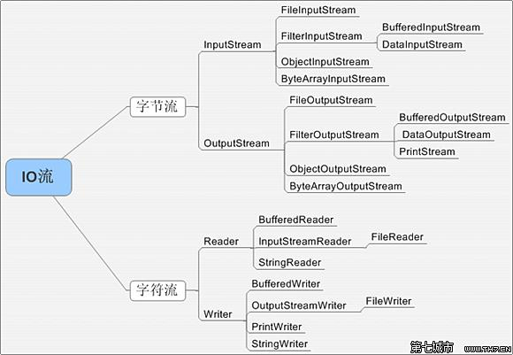

File Stream
====
##
### [返回JavaSE目录](./JavaSEDirectory.md) [回到首页目录](/README.md)

	File类的学习
	文件流的相关概念
	文件流的体系图
	基础流 ★
		FileInputStream
		FileOutputStream
		FileReader
		FileWriter
	包装流 ☆
		BufferedInputStream
		BufferedOutputStream
		BufferedReader
		BufferedWriter

		ObjectInputStream
		ObjectOutputStream

	其他小流
		转换流
		打印流
		控制台IO
		数据流
		随机访问流

## File类

java中实现永久存储的介质：

	文件 √
	数据库
	网络

### File类的说明

	File类是java.util包下的一个类，用于描述一个文件或目录

	可以获取文件或目录的名称、路径、父目录等信息，也可以创建、删除、重命名，但不能读写文件内容，需要通过文件流

### File类的构造器

	new File(String path):根据路径字符串构建一个File对象
	new File(File parent,String childPath):根据父目录和子路径构建一个File对象
	new File(String parent,String childPath):根据父目录和子路径构建一个File对象

### File类的常见方法

	getName：获取文件或目录的名称
	getPath:获取路径（有可能为绝对也有可能为相对）
	getAbsolutePath:获取绝对路径
	getParent:获取父目录的字符串
	length:获取文件的大小
	isFile：判断是否是文件
	isDirectory：判断是否是目录
	isHidden:判断是否隐藏

	createNewFile:创建新文件
	delete:删除文件或空目录
	deleteOnExit:退出程序时删除文件或空目录
	mkdir:创建目录
	mkdirs：创建多级目录
	exists:判断文件或目录是否存在

    list:获取当前目录下的所有子级，返回类型为String[]
    listFiles:获取当前目录下的所有子级，返回类型为File[]
	listFile(FilenameFilter):获取满足某个条件下的当前目录下的子级，返回类型为File[]

### File类的字段

	File.separator 分隔符，windows系统下识别为\\,unix系统下识别为/

	建议大家拼接路径时，采用分隔符，提高移植性

## 文件流的相关概念

	流：stream 数据在程序和文件中的传输
	文件流：又称为IO流
	I：Input输入流  数据从其他节点（源节点）流向程序
	O：Output输出流 数据从程序流向其他节点（目标节点）

	节点：
		源节点：文件、网络、键盘、内存
		目标节点：文件、网络、显示器、内存

## 文件流的分类

按流向分类：

	输入流：数据从其他节点（源节点）流向程序，又称为读取流
	输出流：数据从程序流向其他节点（目标节点），又称为写出流

按传输单位分类：

	字节流：一个字节一个字节的传输（一个汉字占2个字节），一般用于传输 二进制文件，比如图片、视频、音频
	字符流：一个字符一个字符的传输，一般用于传输纯文本文件，效率较高，比如里面包含中文等

按功能分类：

	基础流：用于读写功能
		主要就是四个

	包装流：用于增强一些其他功能
		比如增强效率：缓冲流
		比如实现序列化：对象流
		

## 文件流的体系图

	字节输入流InputStream
		FileInputStream文件字节输入流
		BufferedInputStream字节输入缓存流
		ObjectInputStream 对象输入流
		
		

	字节输出流OutputStream

		FileOutputStream文件字节输出流
		BufferedOutputStream字节输出缓冲流
		ObjectOutputStream 对象输出流

	字符输入流Reader
		FileReader文件字符输入流
		BufferedReader字符输入缓冲流
		

	字符输出流Writer
		FileWriter文件字符输出流
		BufferedWriter字符输出缓冲流

		
## 基础流

### FileInputStream

一、构造器

new FileInputStream(String filepath);//根据路径字符串创建一个输入流对象
new FileInputStream(File file);//根据file对象创建一个输入流对象

二、方法

	read（）：按字节读取，返回读取到的字节，如果读到文件末尾返回-1
	read（byte[]b）：读取到字节数组，返回读取到的字节数，如果读到文件末尾返回-1
	read(byte[]b ,int off,int len)：读取到字节数组的指定部位，返回读取到的字节数，如果读到文件末尾返回-1
	close():关闭流，释放资源，否则容易报溢出的异常

### FileOutputStream

一、构造器

	new FileOutputStream(String path)//创建一个文件输出流对象，默认指针在文件的首位
	new FileOutputStream(String path,true)；//创建一个文件输出流对象，默认指针在文件的最后
	new FileOutputStream(File file)
	new FileOutputStream(File file,true)；

二、方法

	write(int i):写入单个字节
	write(byte[]):写入整个字节数组
	write(byte[],int off,int len):写入字节数组的指定部分

	close():关闭流，释放资源，否则容易报溢出的异常

### FileReader

一、构造器

	new FileReader(String path);//根据路径创建FileReader对象
	new FileReader(File file);//根据file对象创建FileReader对象

二、方法

	read():读取单个字符
	read（char[]）:读取多个字符到char[]
	read(char[],off,len):读取多个字符到char[]的指定位置
	
	close():关闭
	

### FileWriter

一、构造器

	new FileWriter(String path)//创建一个文件输出流对象，默认指针在文件的首位
	new FileWriter(String path,true)；//创建一个文件输出流对象，默认指针在文件的最后
	new FileWriter(File file)
	new FileWriter(File file,true)；

二、方法

	write(char i):写入单个字符
	write(char[]):写入整个字符数组
	write(char[],int off,int len):写入字符数组的指定部分
	write(String str):写入整个字符串
	write(String str，off,int len):写入整个字符串的指定部分
	

	close():先刷新然后关闭流，释放资源，否则容易报溢出的异常
	注意：如果不关闭，则可能不能写入指定的文件，因为需要刷新
	

## 缓冲流

### 功能

	增强效率，底层维护了一个数组

### 分类

	BufferedInputStream
	BufferedOutputStream
	BufferedReader
	BufferdWriter

### 使用步骤

	1.创建缓冲流对象指向一个一个“基础流”
	BufferedReader reader=
		new BufferdReader(new FileReader(string path));

	2.读取
	reader.readLine();

	3.关闭流
	只需要关闭外层的流
	reader.close();

注意：

	四个缓冲流都具备基础流的那些方法，只有
	BufferdReader多出来readLine方法
	BufferedWriter多出来newLine方法

	

## 总结文件流的选择

	读
		字节流（二进制）
			FileInputStream+BufferedInputStream

		字符流（纯文本）
			FileReader+BufferedReader

	写
		字节流（二进制）
			FileOutputStream+BufferedOutputStream

		字符流（纯文本）
			FileWriter+BufferedWriter

	
## 对象流

### 特点

1、对象流又称为序列化和反序列化流，只有两个
	
	   ObjectOutputStream:序列化流
	
	   ObjectInputStream:反序列化流
	
2、对象流的功能：★
	   提供了一系列可以直接用于读写基本数据类型和对象类型的方法
	  
3、读写的顺序要求一致
	 
4、要求读写的数据类型必须实现序列化接口Serilizable
	
5、常见方法：

	  writeXX()
	  readXX();
	  writeObject();//写对象
	  readObject();

6、注意：
	
	 * ① 实现序列化接口，建议添加一个serialVersionUID，为了实现版本兼容性
	 * ② static和transient修饰的属性 不能被序列化
	 * ③ 实现序列化的类中的所有子类也具有序列化功能！！！
	 * ④ 实现序列化类中的所有属性类型也要求实现序列化!!!
  
  
  注意：

  序列化：将内存中的数据 持久化到本地或网络。（将对象或数据 转换成二进制形式）

  反序列化：读取本地或网络的数据到内存中。（将二进制数据拼接成对象或数据）

  实现序列化的目的：为了保证读写的对象是同一个！！！	

	
## 数据流

1.数据流只有两个类
	
	 DataInputStream
	 DataOuputStream
	 
2.层级关系

	 DataInput接口
	  		DataInputStream实现类
	  		ObjectInput子接口
	  				ObjectInputStream实现类
	  
3.数据流的功能：

	 提供了一系列 读写基本数据类型和String类型的方法，没有 读写对象的方法
	  
4.读写的顺序必须一致！！！

## 打印流

	  1.打印流只有两个
	  PrintStream和PrintWriter
	  2.只有输出，没有输入
	  3.提供了一系列的打印方法
	  println
	  print
	  printf
	  
	  4.打印流调用打印方法时，不会抛出异常，因为底层已经处理了
	  5.创建打印流对象时，可以指定输出设备的编码
	  6.打印流可以实现自动刷新，需要构造器中添加一个 boolean类型的参数（true）

## 标准输入输出流IO
 
	  1.标准输入设备：System.int
	  	 标准输出设备：System.out
	  	标准错误输出：System.err   字体红色
	  
	  2.System.in 的类型  InputStream，默认的输入设备是 键盘
	    System.out 的类型 PrintStream,默认的输出设备是 显示器
	     System.err 的类型 PrintStream,默认的输出设备是 显示器
	  3.标准的输入输出设备可以重定向
	    System.setIn(InputStream);//重定向输入设备
	    System.setOut(PrintStream);//重定向输出设备
	    System.setErr(PrintStream);//重定向错误输出设备
	    
	
	

## 随机访问流

	  1、只有一个类：RandomAccessFile
	  2、既可以用于读取又可以用于写入，通过创建RandomAccessFile对象时，传入一个读写模式
	  3、可以自由移动指针
	   通过调用seek(索引) 指定指针位置
	   通过调用getFilePointer() 获取指针位置
	  4、里面提供了一系列对简单类型的读写方法，默认读写时都向后移动指定类型的字节数

	
	
	
	
	

	

	